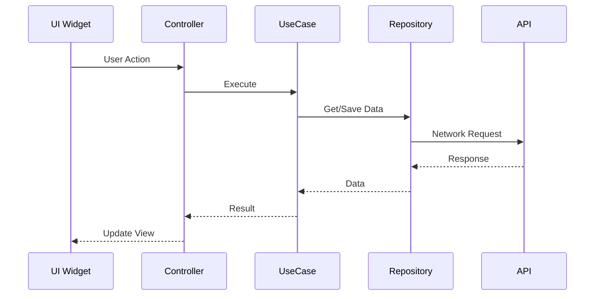

# Development Guidelines

## Documentation Structure

### 1. Feature Documentation Organization

Feature documentation must be organized according to the source code structure in `lib/features/`

#### Structure Pattern
```
Source Code:     lib/features/{feature_name}/
Documentation:   docs/features/{feature_name}/{sub_feature}/
```

#### Examples
```
# Chat Room Feature
Source:  lib/features/chat_room/
Docs:    docs/features/chat_room/send_message/
         docs/features/chat_room/message_list/
         docs/features/chat_room/encryption/

# Call Feature  
Source:  lib/features/call/
Docs:    docs/features/call/video_call/
         docs/features/call/voice_call/
         docs/features/call/call_history/

# Sticker Feature
Source:  lib/features/sticker/
Docs:    docs/features/sticker/sticker_management/
         docs/features/sticker/sticker_store/
```

### 2. Documentation Files Structure

Each feature documentation should consist of:

```
docs/features/{feature_name}/{sub_feature}/
├── overview.md           # Feature overview
├── *_flow.md            # Flow for each type of operation
├── data_models.md       # Models, Collections, Entities
├── api_reference.md     # API and Service methods
└── testing_guide.md     # Testing guidelines
```

### 3. Documentation Content Standards

#### 3.1 File References
- Specify full file path from project root
- Specify line number for important methods
- Format: `file_path:line_number`

Example:
```markdown
**File:** `lib/features/chat_room/domain/use_cases/send_message_to_server_use_case.dart:33`
```

#### 3.2 Method Call Hierarchy
Show method call hierarchy in hierarchical format:

```markdown
1. UI Layer
   ├── ChatRoomTextInput.onSendPressed()
   └── ChatRoomInputController.onSendPressed()
       
2. Presentation Layer  
   └── ChatRoomController.onSendText()
       └── SendMessageToServerUseCase.call()
           
3. Domain Layer
   └── SendMessageToServerUseCase.call()
       ├── putMessageToLocal()
       ├── _lockMessage() [optional]
       └── MessageQueueService.addMessageToQueue()
```

#### 3.3 Sequence Diagrams
Use Mermaid diagrams to show flow:

```markdown

```

#### 3.4 Code Examples
- Show important code examples
- Add comments explaining important parts
- Specify language syntax highlighting

```markdown
```dart
// Example: Send message parameters
SendMessageToServerParams(
  chatRoomId: roomId,
  message: MessageCollection(
    message: userInput,
    type: MessageType.text,
  ),
  roomCryptoKey: cryptoKey,
  accountId: userId,
)
```
```

### 4. Clean Architecture Documentation

When documenting features that use Clean Architecture, organize by layers:

#### Presentation Layer
- Controllers
- UI Widgets  
- State Management

#### Domain Layer
- Use Cases
- Entities
- Domain Services

#### Data Layer
- Repositories
- Data Sources (Local/Remote)
- Models/Collections
- Mappers

### 5. Documentation Maintenance

#### 5.1 When to Update
- When adding new features
- When changing important business logic
- When refactoring code structure
- When changing API contracts

#### 5.2 Review Process
- Documentation must be reviewed alongside code
- Check file references and line numbers
- Update diagrams to match implementation

### 6. Special Documentation Types

#### 6.1 Flow Documentation
For features with complex flows:
- `*_flow.md` - Explain step-by-step
- Call stack and method hierarchy
- Error handling paths
- State changes

#### 6.2 API Documentation  
For services and repositories:
- Method signatures
- Parameters and return types
- Error codes and exceptions
- Usage examples

#### 6.3 Migration Guides
For breaking changes:
- `migration_v{x}_to_v{y}.md`
- Step-by-step migration
- Code examples before/after
- Common issues and solutions

### 7. Documentation Templates

#### Feature Overview Template
```markdown
# [Feature Name] Overview

## Purpose
[Explain the purpose of the feature]

## Architecture
[Diagram showing architecture]

## Key Components
| Component | Responsibility | Location |
|-----------|---------------|----------|
| ... | ... | `path/to/file:line` |

## Related Features
- [Link to related feature]

## API References
- [Link to API docs]
```

#### Flow Documentation Template
```markdown
# [Flow Name] Flow

## Call Stack Overview
[Sequence diagram]

## Detailed Steps

### Step 1: [Step Name]
**File:** `path/to/file:line`
**Method:** `methodName()`

[Description and code example]

### Step 2: [Step Name]
...

## Error Handling
[Error cases and recovery]

## Performance Considerations
[Optimization notes]
```

### 8. Documentation Tools

#### Recommended Tools
- **Mermaid** - For diagrams
- **Markdown** - For formatting
- **draw.io** - For complex diagrams (export as SVG)

#### VS Code Extensions
- Markdown All in One
- Markdown Preview Mermaid Support
- Draw.io Integration

### 9. Documentation Checklist

Before committing documentation:
- [ ] File paths and line numbers are correct
- [ ] Diagrams match implementation
- [ ] Code examples compile and work
- [ ] All links are functional
- [ ] Formatting follows standards
- [ ] Located in correct folder according to structure

### 10. Common Documentation Locations

```
docs/
├── features/              # Feature-specific docs
│   └── {feature_name}/
│       └── {sub_feature}/
├── architecture/          # System architecture
├── api/                   # API documentation
├── guides/                # Development guides
├── deployment/            # Deployment docs
└── DEVELOPMENT_GUIDELINES.md  # This file
```

---

## Code Development Guidelines

### 1. Flutter Version Management (FVM)

**ALWAYS** use FVM commands instead of direct Flutter commands:

```bash
# CORRECT
fvm flutter pub get
fvm flutter run
fvm flutter test
fvm flutter build ios
fvm flutter analyze

# INCORRECT - DO NOT USE
flutter pub get
flutter run
```

### 2. Clean Architecture Rules

As specified in `CLAUDE.local.md`:
- Use Clean Architecture 3 layers: data, domain, presentation
- Avoid using Either for error handling for now
- Use case parameters are located in the same use case file
- Use `toEntity()` method for conversion from Collection/Model → Entity

### 3. File Organization

```
lib/features/{feature_name}/
├── presentation/
│   ├── controllers/
│   ├── widgets/
│   └── pages/
├── domain/
│   ├── entities/
│   ├── repositories/
│   └── use_cases/
└── data/
    ├── data_sources/
    │   ├── local/
    │   └── remote/
    ├── models/
    ├── repositories/
    └── mappers/
```

### 4. Naming Conventions

#### Files
- `snake_case` for all Dart files
- Suffix by type: `_controller.dart`, `_use_case.dart`, `_repository.dart`

#### Classes
- `PascalCase` for class names
- Suffix by responsibility: `Controller`, `UseCase`, `Repository`, `Entity`, `Model`

#### Methods
- `camelCase` for methods
- Prefix by action: `get`, `set`, `update`, `delete`, `fetch`, `save`

### 5. Testing Requirements

- Unit tests for use cases
- Widget tests for UI components
- Integration tests for critical flows
- Always use `fvm flutter test`

### 6. Git Commit Guidelines

Follow conventional commits:
```
feat: Add new feature
fix: Fix bug
docs: Update documentation
style: Format code
refactor: Refactor code
test: Add tests
chore: Update dependencies
```

### 7. Code Quality Tools

Run before committing:
```bash
fvm flutter analyze
fvm flutter format .
fvm flutter test
```

### 8. Performance Guidelines

- Use `const` constructors when possible
- Lazy load heavy resources
- Dispose controllers and subscriptions properly
- Use `ListView.builder` for long lists

### 9. State Management

- GetX for state management
- Controllers for business logic
- Reactive programming with `.obs` and `Obx`

### 10. Error Handling

- Log errors with proper context
- Show user-friendly error messages
- Implement retry mechanisms
- Track errors in analytics