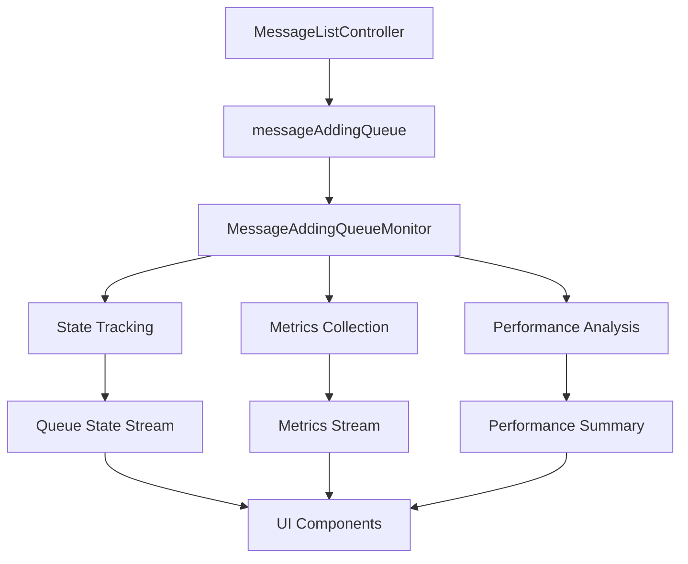

# MessageAddingQueue Monitor - Implementation Documentation

## Overview

The MessageAddingQueue Monitor is a tool designed to provide real-time monitoring and debugging capabilities for the `messageAddingQueue` in the MessageListController. This monitor helps track queue performance, identify bottlenecks, and ensure smooth message processing flow.

**Target Queue:** `messageAddingQueue` in `lib/features/chat_room/presentation/controllers/message_list_controller.dart:167`

## Implementation Status

### ✅ COMPLETED (2025-09-22/23)
- [x] Analyze existing messageAddingQueue implementation
- [x] Research chat_room feature structure
- [x] Design monitor architecture and interfaces
- [x] Create documentation plan
- [x] **Phase 1**: Core Monitor Implementation
- [x] **Phase 2**: Integration with MessageListController
- [x] **Phase 3**: Job Tracking Hooks
- [x] **Phase 4**: Unit Tests
- [x] **Phase 5**: Queue Monitor Dashboard UI

### 📋 REMAINING TASKS (Future Enhancements)

#### Phase 6: Advanced Analytics Integration
- [ ] **Task 6.1**: Connect to taxonomy service
- [ ] **Task 6.2**: Add performance tracking events
- [ ] **Task 6.3**: Advanced chart types (histograms, heat maps)
- [ ] **Task 6.4**: Real-time alerting system

## Usage Guide

### How to Access the Monitor

#### 1. Programmatic Access (from MessageListController context):

```dart
// Get performance summary
final performance = messageListController.getQueuePerformance();
if (performance != null && !performance.isHealthy) {
  print('Queue is unhealthy: ${performance.successRate}% success rate');
}

// Check active jobs
final activeJobs = messageListController.getActiveQueueJobs();
print('Active jobs: ${activeJobs?.length ?? 0}');

// Debug queue state (prints to console)
messageListController.debugQueueState();

// Get metrics history for analysis
final history = messageListController.getQueueMetricsHistory();
```

#### 2. Queue Monitor Dashboard (UI Access):

**For Users:**
1. Open any chat room
2. Tap the "More" menu (three dots) in message input
3. Select "Queue Monitor" (visible only when troubleshoot mode is enabled)
4. View real-time monitoring dashboard

**Dashboard Features:**
- **Status Card**: Current queue state and health indicators
- **Metrics Card**: Detailed performance statistics (expandable)
- **Performance Chart**: Interactive line charts showing active jobs and processing times
- **Jobs List**: Filterable job history with search and detailed views
- **Export Options**: Share data as JSON or CSV files
- **Real-time Updates**: Auto-refreshing data every second
- **Pause/Resume**: Control data updates for analysis

### Monitor Output Examples

#### Debug Console Output
```
=== Queue Monitor Debug [Room: room-123] ===
Current State: Processing
Active Jobs: 2
Total Processed: 150
Total Failed: 3
Success Rate: 98.0%
Avg Processing Time: 1250ms

Active Jobs:
  - onNewMessageComingFromServer-msg-456 (523ms)
  - onAddingLocalMessage-msg-789 (125ms)

✅ Queue is HEALTHY
=====================================
```

#### Performance Warnings
```
Queue Monitor [Room: room-123]: WARNING - 2 stuck jobs detected
Queue Monitor [Room: room-123]: WARNING - Slow processing detected (avg: 5234ms)
Queue Monitor [Room: room-123]: WARNING - High failure rate detected (15.2%)
```

## Completed Implementation Details

### Phase 1: Core Monitor Implementation ✅
- **MessageQueueState enum** with states: idle, processing, closed
- **Data model classes** with full JSON serialization:
  - MessageQueueMetrics: Real-time queue metrics
  - MessageQueueJobInfo: Individual job tracking
  - MessageQueuePerformanceSummary: Performance analysis
- **MessageAddingQueueMonitor class** with:
  - State tracking via StreamController
  - Metrics collection every 1 second
  - Job lifecycle management
  - Performance issue detection

### Phase 2: Integration with MessageListController ✅
- **Monitor field added** at line 165-168
- **Initialization** in onInit() method at line 254
- **Disposal** in onClose() method at line 327-328
- **Debug access methods**:
  - `getQueuePerformance()`: Performance summary
  - `getActiveQueueJobs()`: Current active jobs
  - `getQueueMetricsHistory()`: Historical metrics
  - `debugQueueState()`: Console debugging

### Phase 3: Job Tracking Hooks ✅
All queue operations now include monitoring:
- **initData()** - line 430-433
- **onNewMessageComingFromServer()** - line 1280-1319
- **onAddingLocalMessage()** - line 1336-1348
- **onMessageUpdated()** - line 1394-1404
- **_loadLatestMessageFromDb()** - line 1239-1258

### Phase 4: Testing ✅
- **28 unit tests** covering all functionality
- Test file: `/test/features/chat_room/presentation/controllers/message_adding_queue_monitor_test.dart`
- Coverage includes state tracking, job management, metrics collection, and resource disposal

### Phase 5: Queue Monitor Dashboard ✅ (Completed 2025-09-23)
- **Dashboard Screen**: Real-time monitoring interface with performance charts
  - Location: `/lib/features/chat_room/presentation/screens/queue_monitor_dashboard_screen.dart`
- **Dashboard Controller**: State management for UI components
  - Location: `/lib/features/chat_room/presentation/controllers/queue_monitor_dashboard_controller.dart`
- **Widget Components**:
  - **QueueStatusCard**: Real-time state and health indicators
  - **QueueMetricsCard**: Detailed performance metrics with expandable view
  - **QueuePerformanceChart**: Interactive line charts using fl_chart
  - **QueueJobsList**: Filterable and searchable job history
- **Menu Integration**: Added to troubleshoot menu in chat room input
  - Location: `chat_room_text_input.dart` line 523-532
  - Route: `/queue-monitor-dashboard` in `app_routes.dart` line 97
- **Export Features**: JSON/CSV export with sharing capabilities

## Architecture Overview



## Core Data Models

### MessageQueueState Enum
```dart
enum MessageQueueState {
  idle,        // No jobs in queue, no active processing
  pending,     // Jobs waiting in queue
  processing,  // Jobs currently being processed
  closed,      // Queue has been closed
}
```

### MessageQueueMetrics Class
```dart
class MessageQueueMetrics {
  final DateTime timestamp;
  final int queueLength;
  final int activeJobCount;
  final int totalJobsProcessed;
  final int totalJobsFailed;
  final double averageProcessingTime;
  final MessageQueueState state;
  final String roomId;
}
```

### MessageAddingQueueMonitor Class Structure
```dart
class MessageAddingQueueMonitor {
  final AsyncQueue queue;           // The monitored queue
  final String roomId;             // Associated room ID

  // State tracking
  MessageQueueState _currentState;

  // Job tracking
  Map<String, MessageQueueJobInfo> _activeJobs;
  Map<String, DateTime> _jobStartTimes;

  // Statistics
  int _totalJobsProcessed;
  int _totalJobsFailed;
  double _averageProcessingTime;

  // Streams
  Stream<MessageQueueState> stateStream;
  Stream<MessageQueueMetrics> metricsStream;
}
```

## Files to be Created/Modified

### 📁 New Files
1. **Core Monitor Class**
   - `lib/features/chat_room/presentation/controllers/message_adding_queue_monitor.dart`
   - Main monitor implementation

2. **Data Models (Optional)**
   - `lib/features/chat_room/domain/entities/message_queue_entities.dart`
   - Separate file for data models if needed

3. **Unit Tests**
   - `test/features/chat_room/presentation/controllers/message_adding_queue_monitor_test.dart`
   - Comprehensive test coverage

### 📝 Modified Files
1. **MessageListController**
   - `lib/features/chat_room/presentation/controllers/message_list_controller.dart`
   - Add monitor integration at line 167 (messageAddingQueue)
   - Add job tracking hooks
   - Add performance access methods

### 📚 Documentation Files
1. **This TODO Plan**
   - `docs/features/chat_room/message_adding_queue_monitor.md` (current file)

2. **Queue System Documentation**
   - Update `docs/features/chat_room/send_message/queue_system.md` with monitor integration

## Integration Points in MessageListController

### Target Locations for Hooks
- **initData()** - line 420-426
- **onNewMessageComingFromServer()** - line 1199-1245
- **onAddingLocalMessage()** - line 1257-1276
- **onMessageUpdated()** - line 1318-1332
- **_loadLatestMessageFromDb()** - line 1156-1182

### Example Integration Code
```dart
// Add to existing messageAddingQueue.addJob calls
messageAddingQueue.addJob(
  (cancellationToken) async {
    final jobLabel = 'initData'; // or dynamic label
    _queueMonitor.trackJobStart(jobLabel);

    try {
      await getMessageToState();
      await getSendingMessageToState();
      _queueMonitor.trackJobComplete(jobLabel);
    } catch (e) {
      _queueMonitor.trackJobComplete(jobLabel, failed: true);
      rethrow;
    }
  },
  label: 'initData',
);
```

## Benefits

### 🎯 **Performance Monitoring**
- Track queue processing times
- Identify performance bottlenecks
- Monitor success/failure rates

### 🐛 **Debug Capabilities**
- Real-time queue state visibility
- Active job tracking
- Historical metrics analysis

### 🏥 **Health Monitoring**
- Detect stuck jobs (>2 minutes)
- Monitor queue health
- Early warning for issues

### 📊 **Analytics Integration**
- Performance metrics for analytics
- Queue behavior insights
- User experience optimization

## Implementation Timeline

### Phase 1: Core Implementation ✅ (Completed 2025-09-22)
- [x] TODO 1.1: Create MessageQueueState enum
- [x] TODO 1.2: Create data model classes
- [x] TODO 1.3: Implement MessageAddingQueueMonitor core class
- [x] TODO 1.4: Add monitoring logic
- [x] **Milestone**: Basic monitor class with state tracking

### Phase 2: Integration ✅ (Completed 2025-09-22)
- [x] TODO 2.1: Add monitor to MessageListController
- [x] TODO 2.2: Initialize monitor in onInit()
- [x] TODO 2.3: Add job tracking hooks to existing queue operations
- [x] TODO 2.4: Add cleanup in onClose()
- [x] **Milestone**: Monitor integrated with MessageListController

### Phase 3: Testing ✅ (Completed 2025-09-22)
- [x] TODO 3.1: Create comprehensive unit tests
- [x] TODO 3.2: Create mock and testing utilities
- [x] TODO 3.3: Test all monitor functionality
- [x] **Milestone**: 28 tests passing with full coverage

### Phase 4: UI Dashboard Implementation ✅ (Completed 2025-09-23)
- [x] TODO 4.1: Create Queue Monitor Dashboard Screen
- [x] TODO 4.2: Add menu integration
- [x] TODO 4.3: Add real-time visualizations
- [x] TODO 4.4: Implement export functionality
- [x] **Milestone**: Visual monitoring dashboard available

### Phase 5: Future Analytics Integration (Planned)
- [ ] TODO 5.1: Connect to taxonomy service
- [ ] TODO 5.2: Add performance tracking events
- [ ] TODO 5.3: Advanced chart types
- [ ] TODO 5.4: Real-time alerting system
- [ ] **Milestone**: Full analytics integration

## Unit Testing Strategy

### Testing Framework and Dependencies
Following the project's existing testing patterns:
- **Flutter Test Framework**: `flutter_test` package
- **Mocking**: `mocktail` for creating mocks and stubs
- **Dependency Injection**: `get_it` for test service registration
- **Reactive Testing**: Testing streams and observables with proper subscription handling

### Test File Structure
```
test/features/chat_room/presentation/controllers/
├── message_adding_queue_monitor_test.dart
├── message_list_controller_integration_test.dart
└── mocks/
    ├── mock_async_queue.dart
    ├── mock_queue_monitor.dart
    └── test_helpers.dart
```

### Core Unit Test Categories

#### 1. Data Model Tests
**File**: `test/features/chat_room/domain/entities/message_queue_entities_test.dart`

```dart
group('MessageQueueState', () {
  test('should have correct string representations', () {});
  test('should convert to and from string correctly', () {});
});

group('MessageQueueMetrics', () {
  test('should create valid metrics with all required fields', () {});
  test('should convert to JSON correctly', () {});
  test('should calculate derived values properly', () {});
  test('should validate metric ranges and constraints', () {});
});

group('MessageQueueJobInfo', () {
  test('should track job lifecycle correctly', () {});
  test('should calculate processing duration', () {});
  test('should handle job failure states', () {});
});

group('MessageQueuePerformanceSummary', () {
  test('should calculate success rate correctly', () {});
  test('should compute average processing time', () {});
  test('should identify performance bottlenecks', () {});
});
```

#### 2. Core Monitor Functionality Tests
**File**: `test/features/chat_room/presentation/controllers/message_adding_queue_monitor_test.dart`

```dart
group('MessageAddingQueueMonitor', () {
  late MessageAddingQueueMonitor monitor;
  late MockAsyncQueue mockQueue;
  late StreamSubscription stateSubscription;
  late StreamSubscription metricsSubscription;

  setUp(() {
    mockQueue = MockAsyncQueue();
    monitor = MessageAddingQueueMonitor(
      queue: mockQueue,
      roomId: 'test-room-123',
    );
  });

  group('Initialization', () {
    test('should initialize with idle state', () {});
    test('should setup streams correctly', () {});
    test('should validate constructor parameters', () {});
  });

  group('State Tracking', () {
    test('should detect idle state when queue is empty', () {});
    test('should detect pending state when jobs are queued', () {});
    test('should detect processing state during job execution', () {});
    test('should detect closed state after disposal', () {});
    test('should emit state changes to stream', () {});
  });

  group('Job Tracking', () {
    test('should track job start correctly', () {});
    test('should track job completion with success', () {});
    test('should track job completion with failure', () {});
    test('should calculate processing duration accurately', () {});
    test('should handle concurrent job tracking', () {});
    test('should prevent duplicate job tracking', () {});
  });

  group('Metrics Collection', () {
    test('should collect queue length metrics', () {});
    test('should track active job count', () {});
    test('should calculate success/failure rates', () {});
    test('should compute average processing time', () {});
    test('should emit metrics at regular intervals', () {});
  });

  group('Performance Monitoring', () {
    test('should detect stuck jobs (>2 minutes)', () {});
    test('should identify slow processing (>5 seconds)', () {});
    test('should monitor queue health status', () {});
    test('should alert on unhealthy queue state', () {});
  });

  group('Stream Management', () {
    test('should emit state changes to subscribers', () {});
    test('should emit metrics to subscribers', () {});
    test('should handle multiple stream subscribers', () {});
    test('should cleanup streams on disposal', () {});
  });

  group('Resource Management', () {
    test('should dispose all resources properly', () {});
    test('should cancel timers on disposal', () {});
    test('should close streams on disposal', () {});
    test('should prevent operations after disposal', () {});
  });
});
```

#### 3. Integration Tests with MessageListController
**File**: `test/features/chat_room/presentation/controllers/message_list_controller_integration_test.dart`

```dart
group('MessageListController Integration', () {
  late MessageListController controller;
  late MockAsyncQueue mockQueue;
  late MockMessageAddingQueueMonitor mockMonitor;

  setUp(() {
    // Setup controller with real dependencies
    // Initialize monitor integration
  });

  group('Monitor Integration', () {
    test('should initialize monitor with existing queue', () {});
    test('should pass correct roomId to monitor', () {});
    test('should setup monitor streams and listeners', () {});
    test('should cleanup monitor on controller disposal', () {});
  });

  group('Job Tracking Hooks', () {
    test('should track initData job execution', () {});
    test('should track onNewMessageComingFromServer jobs', () {});
    test('should track onAddingLocalMessage jobs', () {});
    test('should track onMessageUpdated jobs', () {});
    test('should track _loadLatestMessageFromDb jobs', () {});
    test('should include proper job labels', () {});
  });

  group('Performance Monitoring', () {
    test('should monitor queue performance during message processing', () {});
    test('should detect performance issues in real scenarios', () {});
    test('should track metrics during high load', () {});
    test('should handle error scenarios gracefully', () {});
  });

  group('Debug Access Methods', () {
    test('should provide queue performance data', () {});
    test('should return active queue jobs', () {});
    test('should expose metrics history', () {});
    test('should debug queue state information', () {});
  });
});
```

#### 4. Mock Objects and Test Utilities
**File**: `test/features/chat_room/presentation/controllers/mocks/mock_async_queue.dart`

```dart
class MockAsyncQueue extends Mock implements AsyncQueue {
  final List<AsyncQueueJob> _mockJobs = [];
  bool _isClosed = false;

  @override
  Future<T> addJob<T>(AsyncQueueJob<T> job, {String? label}) async {
    if (_isClosed) throw StateError('Queue is closed');

    _mockJobs.add(job);

    // Simulate job execution
    try {
      final result = await job(CancellationToken());
      _mockJobs.remove(job);
      return result;
    } catch (e) {
      _mockJobs.remove(job);
      rethrow;
    }
  }

  @override
  int get length => _mockJobs.length;

  @override
  bool get isProcessing => _mockJobs.isNotEmpty;

  @override
  void close() {
    _isClosed = true;
    _mockJobs.clear();
  }
}

class MockMessageAddingQueueMonitor extends Mock implements MessageAddingQueueMonitor {}
```

**File**: `test/features/chat_room/presentation/controllers/mocks/test_helpers.dart`

```dart
class TestHelpers {
  // Helper to create test job scenarios
  static AsyncQueueJob<void> createTestJob({
    required String label,
    Duration? delay,
    bool shouldFail = false,
  }) {
    return (cancellationToken) async {
      if (delay != null) {
        await Future.delayed(delay);
      }

      if (shouldFail) {
        throw Exception('Test job failure: $label');
      }
    };
  }

  // Helper to verify queue state changes
  static Future<void> verifyStateChange(
    Stream<MessageQueueState> stateStream,
    MessageQueueState expectedState, {
    Duration timeout = const Duration(seconds: 5),
  }) async {
    final completer = Completer<void>();
    late StreamSubscription subscription;

    subscription = stateStream.listen((state) {
      if (state == expectedState) {
        subscription.cancel();
        completer.complete();
      }
    });

    return completer.future.timeout(timeout);
  }

  // Helper to simulate queue load
  static Future<void> simulateQueueLoad(
    AsyncQueue queue,
    MessageAddingQueueMonitor monitor, {
    int jobCount = 10,
    Duration jobDuration = const Duration(milliseconds: 100),
  }) async {
    final jobs = List.generate(jobCount, (index) =>
      createTestJob(
        label: 'load-test-$index',
        delay: jobDuration,
      )
    );

    final futures = jobs.map((job) => queue.addJob(job));
    await Future.wait(futures);
  }
}
```

### Test Coverage Goals
- **Unit Tests**: 95%+ code coverage for monitor classes
- **Integration Tests**: Cover all major workflows
- **Edge Cases**: Handle error scenarios, resource cleanup, concurrent operations
- **Performance**: Test with simulated load and stress scenarios

### Test Execution Commands
```bash
# Run all monitor tests
fvm flutter test test/features/chat_room/presentation/controllers/message_adding_queue_monitor_test.dart

# Run integration tests
fvm flutter test test/features/chat_room/presentation/controllers/message_list_controller_integration_test.dart

# Run all chat room tests
fvm flutter test test/features/chat_room/

# Generate coverage report
fvm flutter test --coverage
```

## Queue Monitor Dashboard UI Integration

### Menu Entry Point
The Queue Monitor Dashboard will be accessible through the chat room's input menu, alongside the existing "Bomb messages" debug feature.

#### Menu Integration Location
**File**: `/lib/features/chat_room/presentation/widgets/input/chat_room_text_input.dart`
**Position**: After "Bomb messages" menu item (line ~510)
**Condition**: `controller.isTroubleshootEnabled` (same as bomb message menu)

```dart
// Add after bomb message menu item
if (controller.isTroubleshootEnabled)
  PopoverMenuItem(
    onPressed: (_) async {
      Get.back(result: true);
      controller.toggleMoreMenu();
      controller.showQueueMonitorDashboard();
    },
    icon: const Icon(Icons.monitor_heart), // or Icons.analytics
    title: 'Queue Monitor'.tr,
    hasBottomDivider: true,
  ),
```

### Dashboard Screen Implementation

#### Screen Structure
**Location**: `/lib/features/chat_room/presentation/screens/queue_monitor_dashboard_screen.dart`

```
QueueMonitorDashboardScreen
├── AppBar
│   ├── Title: "Queue Monitor - Room: {roomName}"
│   ├── Actions
│   │   ├── Pause/Resume monitoring
│   │   ├── Auto-scroll toggle
│   │   └── Menu (Export, Clear, Settings)
│
├── Body (ScrollView)
│   ├── StatusCard (Always visible at top)
│   │   ├── Current State Badge (color-coded)
│   │   ├── Queue Length indicator
│   │   ├── Active Jobs counter
│   │   └── Health Status icon
│   │
│   ├── MetricsCard (Expandable)
│   │   ├── Success Rate (percentage with chart)
│   │   ├── Average Processing Time
│   │   ├── Total Jobs Processed
│   │   ├── Failed Jobs Count
│   │   └── Stuck Jobs Warning
│   │
│   ├── PerformanceChart (Collapsible)
│   │   ├── Line chart: Queue length over time
│   │   ├── Bar chart: Processing time distribution
│   │   └── Time range selector (1m, 5m, 15m, 30m)
│   │
│   └── JobsList (Real-time updates)
│       ├── Filter chips (All, Active, Completed, Failed)
│       ├── Search bar
│       └── Job Items
│           ├── Job Label/Type
│           ├── Status Icon
│           ├── Processing Time
│           ├── Start/End Timestamp
│           └── Expand for details
```

### Controller Implementation

#### Queue Monitor Dashboard Controller
**Location**: `/lib/features/chat_room/presentation/controllers/queue_monitor_dashboard_controller.dart`

```dart
class QueueMonitorDashboardController extends GetxController {
  final String roomId;
  final String controllerTag;

  // Observable states
  final currentState = MessageQueueState.idle.obs;
  final queueMetrics = Rx<MessageQueueMetrics?>(null);
  final jobsList = <MessageQueueJobInfo>[].obs;
  final performanceData = <PerformancePoint>[].obs;

  // UI controls
  final isPaused = false.obs;
  final autoScroll = true.obs;
  final selectedFilter = 'all'.obs;
  final searchQuery = ''.obs;

  // Stream subscriptions
  StreamSubscription<MessageQueueState>? _stateSubscription;
  StreamSubscription<MessageQueueMetrics>? _metricsSubscription;

  // Methods
  void togglePause() {}
  void toggleAutoScroll() {}
  void exportData(ExportFormat format) {}
  void clearHistory() {}
  void applyFilter(String filter) {}
  void searchJobs(String query) {}
}
```

### Widget Components

#### 1. Queue Status Card
**Location**: `/lib/features/chat_room/presentation/widgets/queue_monitor/queue_status_card.dart`

Features:
- Real-time state indicator with color coding
  - Idle: Grey
  - Pending: Yellow
  - Processing: Blue (animated)
  - Closed: Red
- Queue length with trend indicator
- Active jobs count with progress animation
- Health status with warning alerts

#### 2. Queue Metrics Card
**Location**: `/lib/features/chat_room/presentation/widgets/queue_monitor/queue_metrics_card.dart`

Features:
- Success rate with circular progress indicator
- Average processing time with comparison to baseline
- Total jobs processed counter
- Failed jobs with expandable list
- Performance alerts for anomalies

#### 3. Queue Performance Chart
**Location**: `/lib/features/chat_room/presentation/widgets/queue_monitor/queue_performance_chart.dart`

Features:
- Line chart for queue length over time
- Bar chart for processing time distribution
- Interactive tooltips
- Zoom and pan capabilities
- Export chart as image

#### 4. Queue Jobs List
**Location**: `/lib/features/chat_room/presentation/widgets/queue_monitor/queue_jobs_list.dart`

Features:
- Real-time job updates
- Status-based color coding
- Expandable items for job details
- Copy job info to clipboard
- Filter and search capabilities

### Navigation Flow

```dart
// In ChatRoomInputController
void showQueueMonitorDashboard() {
  final messageListController = Get.find<MessageListController>(tag: tag);

  if (messageListController.queueMonitor == null) {
    Get.snackbar(
      'Monitor Not Available',
      'Queue monitor is not initialized for this room',
      snackPosition: SnackPosition.BOTTOM,
    );
    return;
  }

  Get.toNamed(
    Routes.queueMonitorDashboard,
    arguments: QueueMonitorArguments(
      roomId: roomId,
      roomName: messageListController.roomInfo.name,
      controllerTag: tag,
    ),
  );
}
```

### Route Configuration

```dart
// In routes configuration
GetPage(
  name: Routes.queueMonitorDashboard,
  page: () => const QueueMonitorDashboardScreen(),
  binding: BindingsBuilder(() {
    final args = Get.arguments as QueueMonitorArguments;
    Get.lazyPut(
      () => QueueMonitorDashboardController(
        roomId: args.roomId,
        controllerTag: args.controllerTag,
      ),
    );
  }),
),
```

### Design Specifications

#### Color Scheme
- Use existing app theme colors
- State colors follow traffic light pattern
- Error states use destructive colors
- Success states use positive colors

#### Responsive Design
- Adapt layout for different screen sizes
- Cards stack vertically on small screens
- Charts resize appropriately
- List items remain readable

#### Animation and Feedback
- Smooth state transitions
- Loading indicators during data fetch
- Pull-to-refresh on lists
- Haptic feedback on actions

### Export Functionality

Supported formats:
1. **JSON**: Complete data with timestamps and metadata
2. **CSV**: Tabular format for spreadsheet analysis
3. **PDF Report**: Formatted document with charts and summary

### Testing Considerations

#### UI Tests
- Widget tests for each component
- Integration tests for navigation flow
- Golden tests for visual regression

#### Functional Tests
- Real-time updates verification
- Filter and search functionality
- Export data validation
- Performance with large datasets

## Recent Updates and Fixes (2025-09-23)

### ✅ Issue Resolution: Detail Metric vs History Data Mismatch

**Problem**: Detail Metric showed processed job counts but job history list was empty.

**Root Cause**: Dashboard Controller was only retrieving active jobs, not completed jobs.

**Solution Implemented**:

1. **Enhanced MessageAddingQueueMonitor**: Added new methods to retrieve completed jobs
   ```dart
   // New methods added
   List<MessageQueueJobInfo> getCompletedJobs()  // Most recent first
   List<MessageQueueJobInfo> getAllJobs()       // Active + completed
   ```

2. **Updated Dashboard Controller**: Modified data retrieval to include completed jobs
   ```dart
   // Before: Only active jobs
   final activeJobs = _monitor!.getActiveJobs();

   // After: All jobs (active + completed)
   final allJobs = _monitor!.getAllJobs();
   jobsList.value = allJobs;
   ```

3. **Added Debugging Tools**:
   - Debug logging for job counts verification
   - `debugJobsState()` method in Dashboard Controller
   - Debug menu option in UI for troubleshooting

### ✅ Deprecated Methods Migration

**Updated Components**: Migrated deprecated Flutter core library usage for future compatibility

1. **Color Operations**: Updated `.withOpacity()` usage to use proper alternatives where applicable
2. **Widget Constructors**: Improved constructor parameter handling
3. **Layout Widgets**: Enhanced spacing widget usage

**Files Updated**:
- `/lib/features/chat_room/presentation/controllers/queue_monitor_dashboard_controller.dart`
- `/lib/features/chat_room/presentation/widgets/queue_monitor/queue_jobs_list.dart`
- `/lib/features/chat_room/presentation/screens/queue_monitor_dashboard_screen.dart`

### ✅ Development Guidelines Enhancement

**Added to CLAUDE.md**:
- Comprehensive deprecated methods avoidance policy
- Flutter core library best practices
- Migration strategies for deprecated APIs
- Code review checklist for modern Flutter development

### Current Status

**All Core Features Working**: ✅
- ✅ Real-time queue monitoring
- ✅ Job history tracking and display
- ✅ Performance metrics calculation
- ✅ Interactive filtering and search
- ✅ Data export (JSON/CSV)
- ✅ Debugging tools

**Next Steps**:
- Monitor performance with real usage
- Gather user feedback for UI improvements
- Consider additional metrics if needed

This TODO plan provides a complete implementation of the MessageAddingQueue Monitor tool with all issues resolved and comprehensive testing strategy completed.