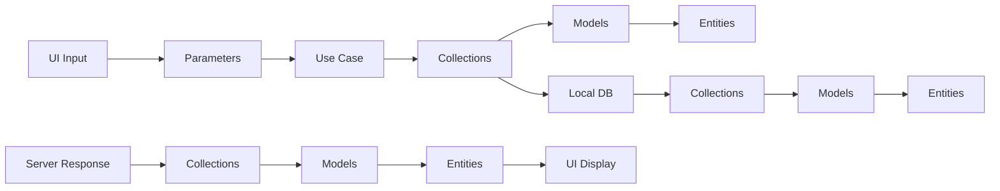

# Data Models and Collections

## Overview

This document describes the data structures used in the send message system, including Collections, Models, Entities, and Parameters

## Data Flow Architecture



---

## 1. Core Message Data Models

### 1.1 MessageCollection

**File:** `lib/features/chat_room/data/models/collections/message_collection.dart`

```dart
class MessageCollection extends HiveObject {
  // Core message properties
  @HiveField(0) String? id;
  @HiveField(1) String? ref;
  @HiveField(2) String? message;
  @HiveField(3) MessageType? type;
  @HiveField(4) String? roomId;
  @HiveField(5) String? accountId;
  @HiveField(6) DateTime? createdAt;
  @HiveField(7) DateTime? updatedAt;
  @HiveField(8) int? sequence;
  
  // Message relationships
  @HiveField(9) MessageModel? replyMessage;
  @HiveField(10) ContactModel? contact;
  @HiveField(11) MobileContactModel? mobileContact;
  
  // Message content
  @HiveField(12) List<MessageFileModel>? files;
  @HiveField(13) List<MessageLinkModel>? links;
  @HiveField(14) MessageMetaModel? meta;
  
  // Message state
  @HiveField(15) bool? isSending;
  @HiveField(16) bool? isSendFailed;
  @HiveField(17) bool? isEncrypted;
  @HiveField(18) bool? isLocked;
  @HiveField(19) bool? isRead;
  @HiveField(20) bool? isEdited;
  @HiveField(21) bool? isDeleted;
  
  // Conversion methods
  MessageModel toModel();
  MessageEntity toEntity();
  MessageCollection copy();
  
  // Static factory methods
  static MessageCollection fromMap(Map<String, dynamic> json);
  static MessageCollection fromModel(MessageModel model);
}
```

#### Key Methods:

```dart
// Convert to domain entity
MessageEntity toEntity() {
  return MessageEntity(
    id: id,
    ref: ref,
    message: message,
    type: type,
    // ... other properties
    replyMessage: replyMessage?.toEntity(),
    contact: contact?.toEntity(),
    files: files?.map((e) => e.toEntity()).toList(),
    meta: meta?.toEntity(),
  );
}

// Create deep copy
MessageCollection copy() {
  return MessageCollection()
    ..id = id
    ..ref = ref
    ..message = message
    // ... copy all properties
}
```

### 1.2 MessageModel

**File:** `lib/features/chat_room/data/models/models/message_model.dart`

```dart
class MessageModel {
  final String? id;
  final String? ref;
  final String? message;
  final MessageType? type;
  final String? roomId;
  final String? accountId;
  final String? accountName;
  final DateTime? createdAt;
  final DateTime? updatedAt;
  final int? sequence;
  
  // Relationships
  final MessageModel? replyMessage;
  final ContactModel? contact;
  final MobileContactModel? mobileContact;
  
  // Content
  final List<MessageFileModel>? files;
  final List<MessageLinkModel>? links;
  final MessageMetaModel? meta;
  
  // State
  final bool? isSending;
  final bool? isSendFailed;
  final bool? isEncrypted;
  final bool? isLocked;
  final bool? isRead;
  final bool? isEdited;
  final bool? isDeleted;
  
  // Constructors
  MessageModel({...});
  MessageModel.fromJson(Map<String, dynamic> json);
  
  // Conversion methods
  Map<String, dynamic> toJson();
  MessageEntity toEntity();
  MessageCollection toCollection();
}
```

### 1.3 MessageEntity (Domain)

**File:** `lib/features/chat_room/domain/entities/message_entity.dart`

```dart
class MessageEntity {
  final String? id;
  final String? ref;
  final String? message;
  final MessageType? type;
  final String? roomId;
  final String? accountId;
  final String? accountName;
  final DateTime? createdAt;
  final DateTime? updatedAt;
  final int? sequence;
  
  // Domain-specific properties
  final MessageEntity? replyMessage;
  final ContactEntity? contact;
  final MobileContactEntity? mobileContact;
  
  final List<MessageFileEntity>? files;
  final List<MessageLinkEntity>? links;
  final MessageMetaEntity? meta;
  
  // State (immutable in domain)
  final bool isSending;
  final bool isSendFailed;
  final bool isEncrypted;
  final bool isLocked;
  final bool isRead;
  final bool isEdited;
  final bool isDeleted;
  
  MessageEntity({
    // Required parameters
    required this.isSending,
    required this.isSendFailed,
    required this.isEncrypted,
    required this.isLocked,
    required this.isRead,
    required this.isEdited,
    required this.isDeleted,
    // Optional parameters
    this.id,
    this.ref,
    this.message,
    // ...
  });
}
```

---

## 2. Message Metadata Models

### 2.1 MessageMetaModel

**File:** `lib/features/chat_room/data/models/models/message_meta_model.dart`

```dart
class MessageMetaModel extends HiveObject {
  // Text message metadata
  @HiveField(0) bool? isEmoji;
  @HiveField(1) bool? isRegEx;
  
  // Sticker metadata
  @HiveField(2) String? stickerPack;
  @HiveField(3) String? stickerValue;
  @HiveField(4) String? stickerPublisher;
  
  // GIF metadata
  @HiveField(5) String? gifUrl;
  @HiveField(6) String? gifMp4Url;
  @HiveField(7) String? gifWebpUrl;
  @HiveField(8) String? giphyId;
  @HiveField(9) int? gifWidth;
  @HiveField(10) int? gifHeight;
  
  // Location metadata
  @HiveField(11) double? locationLat;
  @HiveField(12) double? locationLng;
  @HiveField(13) String? locationName;
  @HiveField(14) String? locationFormattedAddress;
  @HiveField(15) String? locationPlacesId;
  @HiveField(16) String? locationVicinity;
  
  // Lock message metadata
  @HiveField(17) String? lockMessageSalt;
  @HiveField(18) String? lockMessageIv;
  @HiveField(19) String? lockMessageData;
  
  // File metadata
  @HiveField(20) int? width;
  @HiveField(21) int? height;
  @HiveField(22) int? duration;
  @HiveField(23) String? thumbnailUrl;
  
  MessageMetaModel({...});
  
  // Conversion methods
  MessageMetaEntity toEntity();
  Map<String, dynamic> toJson();
  static MessageMetaModel fromJson(Map<String, dynamic> json);
}
```

### 2.2 MessageFileModel

```dart
class MessageFileModel extends HiveObject {
  @HiveField(0) String? id;
  @HiveField(1) String? name;
  @HiveField(2) String? url;
  @HiveField(3) String? thumbnailUrl;
  @HiveField(4) int? size;
  @HiveField(5) String? type;
  @HiveField(6) int? width;
  @HiveField(7) int? height;
  @HiveField(8) int? duration;
  @HiveField(9) String? hash;
  
  // Upload state
  @HiveField(10) bool? isUploading;
  @HiveField(11) double? uploadProgress;
  @HiveField(12) bool? uploadFailed;
  
  MessageFileEntity toEntity();
  Map<String, dynamic> toJson();
}
```

### 2.3 MessageLinkModel

```dart
class MessageLinkModel extends HiveObject {
  @HiveField(0) String? url;
  @HiveField(1) String? title;
  @HiveField(2) String? description;
  @HiveField(3) String? imageUrl;
  @HiveField(4) String? siteName;
  @HiveField(5) String? favicon;
  @HiveField(6) LinkMetadataModel? metadata;
  
  MessageLinkEntity toEntity();
  Map<String, dynamic> toJson();
}
```

---

## 3. Send Message Parameters

### 3.1 SendMessageToServerParams

**File:** `lib/features/chat_room/data/models/send_message_payload/send_message_to_server_params.dart:5`

```dart
class SendMessageToServerParams {
  final String chatRoomId;
  final String? messageRef;
  final bool isSecretRoom;
  final bool isShare;
  final MessageCollection message;
  final bool? isLocked;
  final AesGcmSecretKey? roomCryptoKey;
  final String? bookmarkTagId;
  final MessageModel? replyMessage;
  final String accountId;
  final bool isSending;
  final bool isResend;
  
  SendMessageToServerParams({
    required this.chatRoomId,
    required this.isSecretRoom,
    required this.message,
    required this.accountId,
    this.isLocked = false,
    this.isSending = false,
    this.isShare = false,
    this.replyMessage,
    this.roomCryptoKey,
    this.bookmarkTagId,
    this.messageRef,
    this.isResend = false,
  }) : assert(!(isResend == true && (messageRef == null || messageRef.isEmpty)),
            'messageRef must be provided if isResend is true');
}
```

### 3.2 SendFileMessageParams

```dart
class SendFileMessageParams {
  final String chatRoomId;
  final bool isSecretRoom;
  final List<FileInfoModel> files;
  final MessageCollection message;
  final AesGcmSecretKey? roomCryptoKey;
  final String? bookmarkTagId;
  final MessageModel? replyMessage;
  final String accountId;
  final bool isSending;
  final bool isMultiple;
  
  SendFileMessageParams({...});
}
```

---

## 4. Request Models

### 4.1 SendMessageRequest

**File:** `lib/features/chat_room/data/models/send_message_payload/send_message_request.dart:7`

```dart
class SendMessageRequest implements SendMessageRequestInterface {
  @override String roomId;
  @override String ref;
  @override Future<void> Function()? onSendFail;
  
  MessageCollection message;
  MessageCollection initMessage;
  String? replyId;
  String? contactId;
  MobileContactModel? mobileContact;
  bool? isEncrypted;
  bool? isLocked;
  String? bookmarkTagId;
  
  SendMessageRequest({
    required this.roomId,
    required this.ref,
    required this.message,
    required this.initMessage,
    this.replyId,
    this.onSendFail,
    this.contactId,
    this.mobileContact,
    this.isEncrypted,
    this.isLocked,
    this.bookmarkTagId,
  });
  
  Map<String, dynamic> toMap() {
    Map<String, dynamic> json = {
      'roomId': roomId,
      'message': message.message,
      'type': message.type?.value,
      'contactId': contactId,
      'ref': ref,
      'mobileContact': mobileContact?.toJson(),
      'isEncrypted': isEncrypted,
      'isLocked': isLocked,
      'emojiTagId': bookmarkTagId,
    };
    
    // Add metadata based on message type
    final meta = message.meta;
    if (meta != null) {
      if (message.type == MessageType.sticker) {
        json['meta'] = {
          'stickerPack': meta.stickerPack,
          'stickerValue': meta.stickerValue
        };
      }
      
      if (message.type == MessageType.gif) {
        json['meta'] = {
          'gifUrl': meta.gifUrl,
          'gifMp4Url': meta.gifMp4Url,
          'gifWebpUrl': meta.gifWebpUrl,
          'giphyId': meta.giphyId,
          'gifWidth': meta.gifWidth,
          'gifHeight': meta.gifHeight,
        };
      }
      
      if (message.type == MessageType.location) {
        json['meta'] = {
          'locationLat': meta.locationLat,
          'locationLng': meta.locationLng,
          'locationName': meta.locationName,
          'locationFormattedAddress': meta.locationFormattedAddress,
          'locationPlacesId': meta.locationPlacesId,
          'locationVicinity': meta.locationVicinity,
        };
      }
      
      // Add lock message metadata if locked
      if (message.isLocked == true) {
        json['meta'] ??= {};
        json['meta'].addAll({
          'lockMessageSalt': meta.lockMessageSalt,
          'lockMessageIv': meta.lockMessageIv,
          'lockMessageData': meta.lockMessageData,
        });
      }
    }
    
    if (replyId != null) {
      json['replyId'] = replyId;
    }
    
    return json;
  }
}
```

### 4.2 SendFileMessageRequest

```dart
class SendFileMessageRequest implements SendMessageRequestInterface {
  @override String roomId;
  @override String ref;
  @override Future<void> Function()? onSendFail;
  
  String refFile;
  FileInfoModel file;
  MessageCollection message;
  MessageCollection initMessage;
  String? replyId;
  bool? isEncrypted;
  bool? isLocked;
  
  SendFileMessageRequest({...});
  
  // File upload methods
  Future<String?> upload();
  Future<void> uploadWithProgress({
    required Function(int sent, int total) onProgress,
  });
  
  Map<String, dynamic> toMap();
}
```

---

## 5. Response Models

### 5.1 SendMessageResponse

```dart
class SendMessageResponse {
  MessageCollection? message;
  
  SendMessageResponse({this.message});
  
  factory SendMessageResponse.fromMap(Map<String, dynamic> json) {
    return SendMessageResponse(
      message: MessageCollection.fromMap(json)
    );
  }
}
```

### 5.2 SendFileMessageResponse

```dart
class SendFileMessageResponse {
  MessageCollection? message;
  List<MessageFileModel>? uploadedFiles;
  
  SendFileMessageResponse({
    this.message,
    this.uploadedFiles,
  });
  
  factory SendFileMessageResponse.fromMap(Map<String, dynamic> json);
}
```

---

## 6. Contact Models

### 6.1 ContactModel (UChat Contact)

```dart
class ContactModel extends HiveObject {
  @HiveField(0) String? id;
  @HiveField(1) String? accountId;
  @HiveField(2) String? displayName;
  @HiveField(3) String? username;
  @HiveField(4) String? email;
  @HiveField(5) String? phoneNumber;
  @HiveField(6) String? avatarUrl;
  @HiveField(7) ContactStatus? status;
  @HiveField(8) DateTime? lastSeenAt;
  
  ContactEntity toEntity();
  Map<String, dynamic> toJson();
}
```

### 6.2 MobileContactModel (Phone Contact)

```dart
class MobileContactModel extends HiveObject {
  @HiveField(0) String? displayName;
  @HiveField(1) String? phoneNumber;
  @HiveField(2) String? email;
  @HiveField(3) List<String>? phoneNumbers;
  @HiveField(4) List<String>? emails;
  @HiveField(5) String? avatarPath;
  
  MobileContactEntity toEntity();
  Map<String, dynamic> toJson();
}
```

---

## 7. File Information Models

### 7.1 FileInfoModel

**File:** `lib/entities/models/file_info_model.dart`

```dart
class FileInfoModel {
  final String name;
  final String path;
  final int size;
  final String type;
  final String extension;
  final DateTime createdAt;
  final String? thumbnailPath;
  final int? width;
  final int? height;
  final int? duration;
  final String? hash;
  
  FileInfoModel({...});
  
  // Factory constructors
  static Future<FileInfoModel> fromFile(File file, int size);
  static Future<FileInfoModel> fromImageFile(File file);
  static Future<FileInfoModel> fromVideoFile(File file);
  
  // Conversion methods
  MessageFileModel toMessageFile();
  Map<String, dynamic> toJson();
}
```

---

## 8. Enum Definitions

### 8.1 MessageType

**File:** `lib/entities/enum/message_type.dart`

```dart
enum MessageType {
  text('text'),
  image('image'),
  video('video'),
  file('file'),
  audio('audio'),
  sticker('sticker'),
  gif('gif'),
  location('location'),
  contact('contact'),
  mobileContact('mobile_contact'),
  call('call'),
  system('system');
  
  const MessageType(this.value);
  final String value;
  
  static MessageType? fromString(String? value) {
    for (MessageType type in MessageType.values) {
      if (type.value == value) return type;
    }
    return null;
  }
}
```

---

## 9. Data Transformation Patterns

### 9.1 Collection ↔ Model ↔ Entity

```dart
// Collection to Model (Data → Domain)
MessageModel model = messageCollection.toModel();

// Model to Entity (Data → Domain)
MessageEntity entity = messageModel.toEntity();

// Collection to Entity (Direct conversion)
MessageEntity entity = messageCollection.toEntity();

// Entity to Model (Domain → Data)
MessageModel model = MessageModel.fromEntity(entity);

// Model to Collection (Domain → Data)
MessageCollection collection = messageModel.toCollection();
```

### 9.2 Server Response → Local Storage

```dart
// Server JSON → Collection → Local DB
Map<String, dynamic> serverJson = {...};
MessageCollection collection = MessageCollection.fromMap(serverJson);
await messageDb.putMessage(collection);

// Local DB → Collection → UI Entity
MessageCollection? collection = await messageDb.getMessageById(messageId);
MessageEntity entity = collection?.toEntity();
```

### 9.3 UI Input → Server Request

```dart
// UI Input → Parameters → Use Case
SendMessageToServerParams params = SendMessageToServerParams(
  chatRoomId: roomId,
  message: MessageCollection(
    message: userInput,
    type: MessageType.text,
  ),
  accountId: userId,
);

// Use Case → Request Model → Server API
SendMessageRequest request = SendMessageRequest(
  roomId: params.chatRoomId,
  message: params.message,
  ref: generatedRef,
);

Map<String, dynamic> serverPayload = request.toMap();
```

## 10. Validation and Constraints

### 10.1 Message Validation

```dart
// Message length constraints
static const int maxMessageLength = 4096;
static const int maxFileSize = 100 * 1024 * 1024; // 100MB

// Required fields validation
bool isValidMessage(MessageCollection message) {
  if (message.type == null) return false;
  if (message.roomId?.isEmpty ?? true) return false;
  if (message.accountId?.isEmpty ?? true) return false;
  
  switch (message.type!) {
    case MessageType.text:
      return message.message?.isNotEmpty ?? false;
    case MessageType.file:
    case MessageType.image:
    case MessageType.video:
      return message.files?.isNotEmpty ?? false;
    case MessageType.contact:
      return message.contact != null;
    case MessageType.mobileContact:
      return message.mobileContact != null;
    default:
      return true;
  }
}
```

### 10.2 File Validation

```dart
bool isValidFileType(String type) {
  const allowedTypes = [
    'image/jpeg', 'image/png', 'image/gif', 'image/webp',
    'video/mp4', 'video/mov', 'video/avi',
    'application/pdf', 'application/msword',
    'application/vnd.openxmlformats-officedocument.wordprocessingml.document',
    // ... more types
  ];
  return allowedTypes.contains(type.toLowerCase());
}

bool isValidFileSize(int size, MessageType type) {
  switch (type) {
    case MessageType.image:
      return size <= 10 * 1024 * 1024; // 10MB
    case MessageType.video:
      return size <= 100 * 1024 * 1024; // 100MB
    case MessageType.file:
      return size <= 50 * 1024 * 1024; // 50MB
    default:
      return true;
  }
}
```