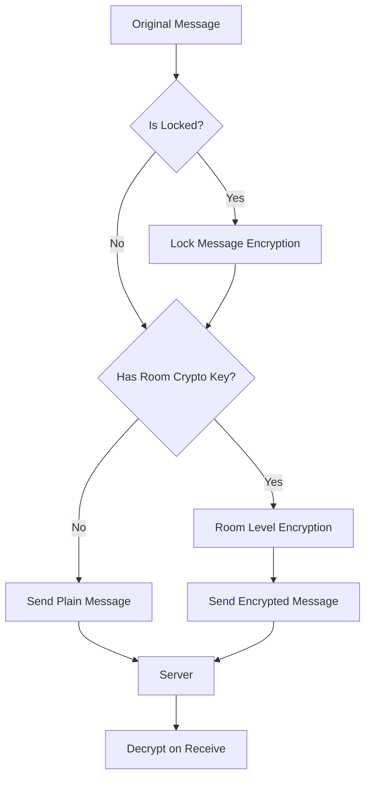
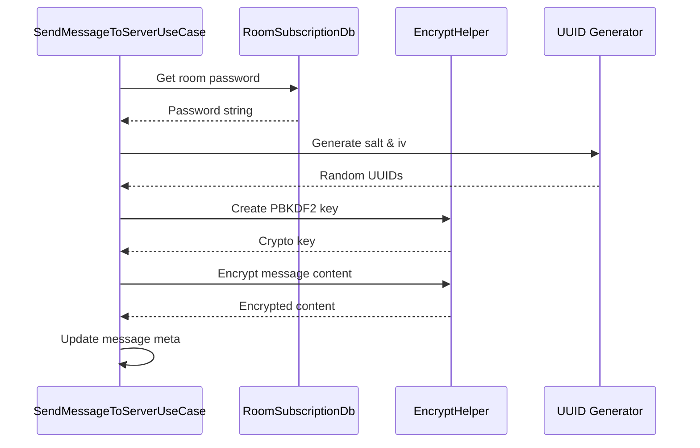
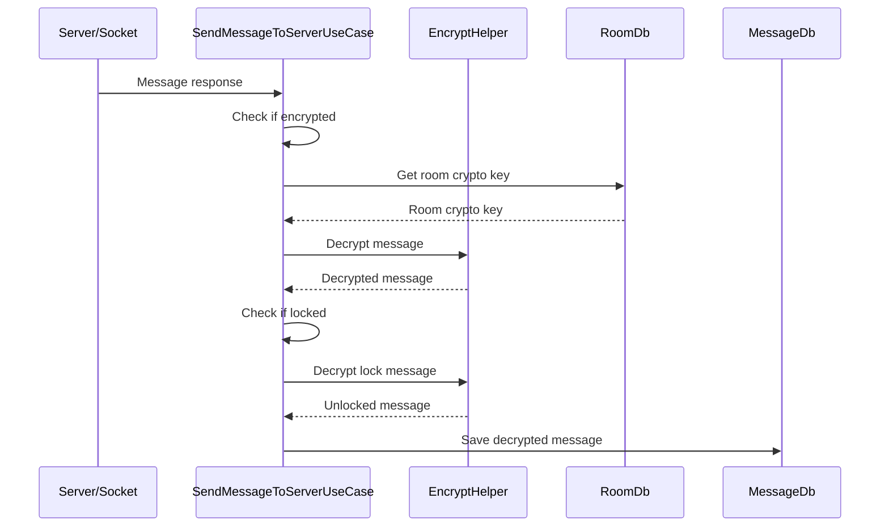

# Encryption Flow

## Overview

UChat has 2 levels of encryption:

1. **Room-Level Encryption (E2E)** - Encrypts entire room for Secret Rooms
2. **Message-Level Lock** - Encrypts specific messages with password

## Encryption Architecture



---

## 1. Lock Message Encryption (Message-Level)

### Encryption Flow

**File:** `lib/features/chat_room/domain/use_cases/send_message_to_server_use_case.dart`



### Lock Message Implementation

```dart
_lockMessage(MessageCollection message, String roomId) // line 306
├── Step 1: Get room subscription password
├── Step 2: Generate encryption parameters
├── Step 3: Create PBKDF2 crypto key  
├── Step 4: Encrypt content by message type
└── Step 5: Store encryption metadata
```

#### Step 1: Password Retrieval
```dart
final roomSubscription = await roomSubscriptionDb.getRoomSubscriptionWithRoomId(roomId);
if (roomSubscription?.password == null) {
  return Left('No password found for room subscription');
}
```

#### Step 2: Generate Encryption Parameters
```dart
const uuid = Uuid();
final salt = uuid.v4();  // Random salt for PBKDF2
final iv = uuid.v4();    // Initialization vector

message.meta ??= MessageMetaModel();
message.meta?.lockMessageSalt = salt;
message.meta?.lockMessageIv = iv;
```

#### Step 3: Create Crypto Key
```dart
final lockedKey = await EncryptHelper.instance.createCryptoKeyFromPbkdf2Key(
  password: roomSubscription.password!,
  salt: salt,
);
```

#### Step 4: Encrypt by Message Type

##### Text Message Encryption
```dart
if (messageType == MessageType.text) {
  final encryptedLockedMessage = await EncryptHelper.instance.encryptLockMessageText(
    message: message.message ?? '',
    iv: iv,
    cryptoKey: lockedKey,
  );
  message.message = encryptedLockedMessage;
}
```

##### Mobile Contact Encryption
```dart
else if (messageType == MessageType.mobileContact) {
  final name = await EncryptHelper.instance.encryptLockMessageText(
    message: message.mobileContact?.displayName ?? '',
    iv: iv,
    cryptoKey: lockedKey,
  );
  final phoneNumber = await EncryptHelper.instance.encryptLockMessageText(
    message: message.mobileContact?.phoneNumber ?? '',
    iv: iv, 
    cryptoKey: lockedKey,
  );
  message.mobileContact?.displayName = name;
  message.mobileContact?.phoneNumber = phoneNumber;
}
```

##### Contact Message Lock
```dart
else if (message.type == MessageType.contact) {
  // Contact ID can't be encrypted (server needs it)
  // Store encrypted validation data for password check
  final lockData = await EncryptHelper.instance.encryptLockMessageText(
    message: message.contact?.id ?? '',
    iv: iv,
    cryptoKey: lockedKey,
  );
  message.meta?.lockMessageData = lockData;
}
```

##### GIF Message Encryption
```dart
else if (message.type == MessageType.gif) {
  final gifMp4Url = await EncryptHelper.instance.encryptLockMessageText(
    message: message.meta?.gifMp4Url ?? '',
    iv: iv,
    cryptoKey: lockedKey,
  );
  message.meta?.gifMp4Url = gifMp4Url;
  
  final gifUrl = await EncryptHelper.instance.encryptLockMessageText(
    message: message.meta?.gifUrl ?? '',
    iv: iv,
    cryptoKey: lockedKey,
  );
  message.meta?.gifUrl = gifUrl;
  
  // Similar for gifWebpUrl and giphyId
}
```

##### Sticker Message Lock
```dart
else if (message.type == MessageType.sticker) {
  // Sticker pack/value can't be encrypted (server needs them)
  // Store encrypted validation data
  final lockData = await EncryptHelper.instance.encryptLockMessageText(
    message: '${message.meta?.stickerPack}/${message.meta?.stickerValue}',
    iv: iv,
    cryptoKey: lockedKey,
  );
  message.meta?.lockMessageData = lockData;
}
```

##### Location Message Encryption
```dart
else if (message.type == MessageType.location) {
  final locationName = await EncryptHelper.instance.encryptLockMessageText(
    message: message.meta?.locationName ?? '',
    iv: iv,
    cryptoKey: lockedKey,
  );
  message.meta?.locationName = locationName;
  
  final locationVicinity = await EncryptHelper.instance.encryptLockMessageText(
    message: message.meta?.locationVicinity ?? '',
    iv: iv,
    cryptoKey: lockedKey,
  );
  message.meta?.locationVicinity = locationVicinity;
}
```

### Lock Message Metadata Structure
```dart
MessageMetaModel(
  // Encryption parameters
  lockMessageSalt: "uuid-v4-salt",
  lockMessageIv: "uuid-v4-iv",
  lockMessageData: "encrypted-validation-data", // For types that can't encrypt main content
  
  // Original message-specific fields (some may be encrypted)
  stickerPack: "pack-id", // Not encrypted
  stickerValue: "sticker-id", // Not encrypted  
  gifUrl: "encrypted-url", // Encrypted
  locationLat: 13.7563, // Not encrypted (coordinates needed for map)
  locationName: "encrypted-name", // Encrypted
)
```

---

## 2. Room-Level Encryption (E2E)

### Encryption Flow

**File:** `lib/features/chat_room/domain/use_cases/send_message_to_server_use_case.dart`

```dart
// Room encryption happens AFTER lock message encryption
if (params.roomCryptoKey != null && updatedMessage.message != null) // line 75
├── EncryptHelper.instance.encrypt()
├── Set updatedMessage.isEncrypted = true  
└── Handle encryption errors
```

### Room Encryption Implementation

```dart
try {
  updatedMessage.message = await EncryptHelper.instance.encrypt(
    text: updatedMessage.message!,
    cryptoKey: params.roomCryptoKey!,
    messageRef: updatedMessage.ref!,
  );
  updatedMessage.isEncrypted = true;
} catch (e, stackTrace) {
  _log.e('Encrypt message before send error.', e, stackTrace);
}
```

### Room Crypto Key Management

#### Key Generation
```dart
// Generated when secret room is created
final roomCryptoKey = await EncryptHelper.instance.generateAesGcmSecretKey();
await room.setRoomCryptoKey(roomCryptoKey);
```

#### Key Storage
```dart
// Stored encrypted with user's master key
final encryptedKey = await EncryptHelper.instance.encryptCryptoKey(
  cryptoKey: roomCryptoKey,
  userMasterKey: userKey,
);
await roomDb.putRoomCryptoKey(roomId, encryptedKey);
```

#### Key Retrieval
```dart
final room = await roomDb.getRoom(roomId);
final roomCryptoKey = await room?.getRoomCryptoKeyObj();
```

---

## 3. Decryption Flow (Message Receive)

### Decryption Sequence



### Room-Level Decryption

**File:** `lib/features/chat_room/domain/use_cases/send_message_to_server_use_case.dart`

```dart
// Decrypt room-level encryption after server response
final room = await roomDb.getRoom(messageFromResp.roomId!);
try {
  final roomCryptoKey = await room?.getRoomCryptoKeyObj();
  if (roomCryptoKey != null) {
    messageFromResp = (await EncryptHelper.instance.decryptMessageCollection(
      message: messageFromResp,
      cryptoKey: roomCryptoKey,
      room: room,
    ))!;
  }
} catch (e, stackTrace) {
  _log.e('decrypt message error.', e, stackTrace);
}
```

### Lock Message Decryption

Lock message decryption happens when user views the message and enters password:

```dart
// Triggered when user taps locked message
unlockMessage(String messageId, String password) 
├── Get message from local DB
├── Extract salt and iv from message.meta
├── Create PBKDF2 key from password + salt
├── Decrypt message content based on type
├── Update UI to show unlocked content
└── Cache unlocked content temporarily
```

---

## 4. Encryption Helper Methods

**File:** `lib/utils/encrypt_helper.dart`

### Key Generation Methods
```dart
class EncryptHelper {
  // Generate AES-GCM key for room encryption
  Future<AesGcmSecretKey> generateAesGcmSecretKey()
  
  // Create PBKDF2 key from password + salt
  Future<Pbkdf2SecretKey> createCryptoKeyFromPbkdf2Key({
    required String password,
    required String salt,
  })
}
```

### Room Encryption Methods
```dart
// Encrypt message with room key
Future<String> encrypt({
  required String text,
  required AesGcmSecretKey cryptoKey,
  required String messageRef,
})

// Decrypt message with room key
Future<MessageCollection?> decryptMessageCollection({
  required MessageCollection message,
  required AesGcmSecretKey cryptoKey,
  RoomCollection? room,
})
```

### Lock Message Methods
```dart
// Encrypt text for lock message
Future<String> encryptLockMessageText({
  required String message,
  required String iv,
  required Pbkdf2SecretKey cryptoKey,
})

// Decrypt lock message text
Future<String> decryptLockMessageText({
  required String encryptedMessage,
  required String iv,
  required Pbkdf2SecretKey cryptoKey,
})
```

## 5. Security Considerations

### Key Management
- **Room keys** stored encrypted with user master key
- **Lock passwords** stored in local room subscription
- **Salt/IV** generated uniquely per message
- **No key reuse** between messages

### Encryption Strength
- **AES-GCM-256** for room encryption
- **PBKDF2** for password-based lock encryption  
- **Random UUID** for salt/IV generation
- **Message ref** as additional authenticated data

### Forward Secrecy
- Room keys can be rotated
- Lock passwords changeable per room
- Old messages remain encrypted with old keys

### Data Leakage Prevention
```dart
// Sensitive fields that are NOT encrypted:
├── Message timestamps (needed for sorting)
├── Message IDs/refs (needed for deduplication)
├── Room IDs (needed for routing)
├── Account IDs (needed for attribution)
├── Message types (needed for rendering)
└── File IDs (needed for download)

// Fields that ARE encrypted:
├── Message text content
├── File names (in metadata)
├── Location names/addresses
├── Contact names/phone numbers
└── GIF URLs (to hide search terms)
```

## 6. Error Handling

### Encryption Errors
```dart
try {
  // Encryption operation
} catch (e, stackTrace) {
  _log.e('Encryption failed', e, stackTrace);
  // Fall back to sending unencrypted
  // OR mark message as failed
}
```

### Decryption Errors  
```dart
try {
  // Decryption operation  
} catch (e, stackTrace) {
  _log.e('Decryption failed', e, stackTrace);
  // Show "Unable to decrypt" message
  // Keep encrypted data for retry
}
```

### Key Management Errors
```dart
// Missing room key
if (roomCryptoKey == null) {
  _log.w('No room crypto key available');
  // Request key from other devices
  // OR show "Encryption unavailable" 
}

// Wrong lock password
if (!isValidPassword(password)) {
  throw InvalidPasswordException();
  // Show "Incorrect password" error
}
```

## 7. Performance Optimizations

### Caching
- **Decrypted content** cached temporarily in memory
- **Room crypto keys** cached after first load
- **Lock passwords** stored locally per room

### Lazy Decryption
- **Lock messages** only decrypted when viewed
- **Room messages** decrypted on receive
- **File metadata** decrypted on demand

### Batch Processing
- **Multiple messages** can be encrypted/decrypted in batch
- **Key derivation** cached to avoid repeated PBKDF2 calculations