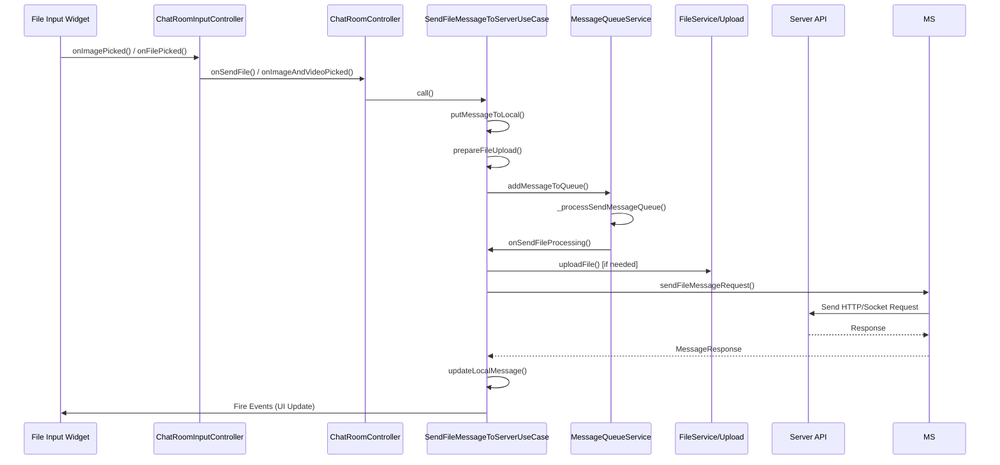
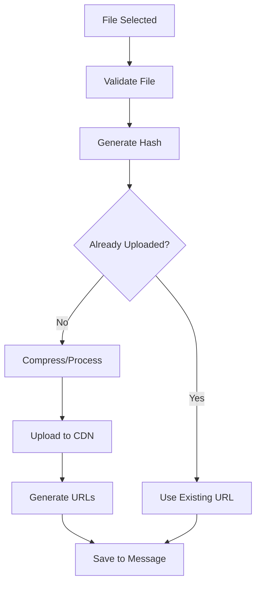

# File Message Flow

## Call Stack Overview



## File Types Support

### Supported File Types
- **Images**: JPG, PNG, GIF, WebP
- **Videos**: MP4, MOV, AVI 
- **Documents**: PDF, DOC, DOCX, XLS, XLSX, PPT, PPTX
- **Archives**: ZIP, RAR, 7Z
- **Others**: Based on MIME type validation

## Detailed Flow Steps

### 1. File Input Sources

#### Image/Video Picker
**File:** `lib/features/chat_room/presentation/widgets/input/chat_room_image_and_video_input.dart`

```dart
// Multiple file selection sources:
├── Camera capture
├── Photo gallery
├── Video gallery  
└── File system picker
```

#### File Document Picker  
**File:** `lib/features/chat_room/presentation/controllers/input/chat_room_input_controller.dart`

```dart
sendFile(Function(FileInfoModel) onSendFile) // line 848
├── GetIt.I<PickFileUseCase>().call()
├── File validation
└── onSendFile() callback
```

### 2. File Processing - Input Controller

**File:** `lib/features/chat_room/presentation/controllers/input/chat_room_input_controller.dart`

```dart
// Image/Video Selection
onImageAndVideoPicked(MediaGalleryResult result)
├── File validation (size, type)
├── Generate preview thumbnails
├── Prepare FileInfoModel objects
└── Pass to ChatRoomController

// Document File Selection  
onFilePicked(FileInfoModel file)
├── File size validation
├── MIME type validation
├── File name sanitization
└── Pass to ChatRoomController
```

### 3. Room Controller - File Message Preparation

**File:** `lib/features/chat_room/presentation/controllers/chat_room_controller.dart`

```dart
// Single Image/Video
onSendImageAndVideo(MediaGalleryResult media) // line ~900
├── Create MessageCollection with MessageType.image/video
├── Set file metadata (size, dimensions, duration)
├── Generate thumbnail data
└── Call SendFileMessageToServerUseCase

// Multiple Images/Videos  
onSendMultipleImageAndVideo(List<MediaGalleryResult> mediaList)
├── Create multiple MessageCollection objects
├── Batch processing for multiple files
├── Generate SendMultiFileMessageRequest
└── Add to message queue

// Document File
onSendFile(FileInfoModel file)
├── Create MessageCollection with MessageType.file
├── Set file metadata (name, size, type)
├── Generate file icon/preview
└── Call SendFileMessageToServerUseCase
```

### 4. Domain Layer - File Business Logic

**File:** `lib/features/chat_room/domain/use_cases/send_file_message_to_server_use_case.dart`

```dart
SendFileMessageToServerUseCase.call(SendFileMessageParams params) 
├── Step 1: putMessageToLocal()
├── Step 2: prepareFileUpload()
├── Step 3: _lockFileMessage() [if locked]
├── Step 4: Create SendFileMessageRequest
└── Step 5: MessageQueueService.addMessageToQueue()
```

#### File Message Parameters
```dart
SendFileMessageParams(
  chatRoomId: roomId,
  isSecretRoom: roomType == RoomType.directSecret,
  files: [FileInfoModel],
  message: MessageCollection(
    type: MessageType.image/video/file,
    files: [MessageFileModel],
    meta: MessageMetaModel(),
  ),
  roomCryptoKey: cryptoKey,
  accountId: userId,
  replyMessage: replyMsg,
)
```

#### Step 1: Save File Message to Local
```dart
putFileMessageToLocal()
├── Generate messageRef
├── Create MessageCollection with file data
├── Generate thumbnails [for images/videos]
├── Calculate file hash [for deduplication]
└── messageDb.putMessage()
```

#### Step 2: File Upload Preparation
```dart
prepareFileUpload()
├── Check if file already uploaded (hash lookup)
├── Compress images [if needed]
├── Generate upload URL
├── Prepare multipart upload data
└── Set upload progress callbacks
```

### 5. File Upload Process

**File:** `lib/features/chat_room/data/models/send_message_payload/send_file_message_request.dart`

```dart
SendFileMessageRequest.upload() 
├── Create multipart form data
├── Set upload progress callback
├── Handle upload cancellation
├── Retry failed uploads
└── Return uploaded file URL/ID
```

#### Upload Progress Handling
```dart
onUploadProgress(int sent, int total)
├── Calculate percentage
├── Update UI progress bar
├── Fire UploadProgressEvent
└── Handle upload completion
```

### 6. Message Queue Processing

**File:** `lib/core/services/messaging/message_queue_service.dart`

```dart
// File messages have special queue handling
addFileMessageToQueue()
├── Check if file upload needed
├── Start upload process [parallel]
├── Add message request to queue
└── Track file upload status

_processSendFileMessageQueue()
├── Wait for file upload completion
├── Update message with file URLs
├── Send message request to server
└── Handle upload/send failures
```

### 7. Send File Message to Server

```dart
onSendFileMessageProcessing(SendFileMessageRequest request)
├── Ensure file upload completed
├── Create server request payload
├── Include file URLs/IDs in message
├── Send via MessageService
├── Handle server response
└── Update local message with server data
```

#### File Message Payload Structure
```json
{
  "roomId": "room123",
  "type": "image",
  "ref": "msg-ref-123",
  "files": [
    {
      "id": "file-id-123",
      "name": "image.jpg",
      "size": 1024000,
      "type": "image/jpeg",
      "url": "https://cdn.example.com/files/...",
      "thumbnailUrl": "https://cdn.example.com/thumbs/..."
    }
  ],
  "meta": {
    "width": 1920,
    "height": 1080,
    "duration": null
  }
}
```

## File-Specific Features

### 1. Image Messages
- **Automatic compression** based on quality settings
- **Thumbnail generation** for quick preview
- **EXIF data removal** for privacy
- **Multiple format support** (JPG, PNG, WebP)

```dart
ImageMessage Processing:
├── Load original image
├── Generate thumbnail (200x200)
├── Apply compression (quality: 0.8)
├── Remove EXIF metadata
├── Calculate dimensions
└── Upload both original and thumbnail
```

### 2. Video Messages  
- **Video compression** for large files
- **Thumbnail extraction** from first frame
- **Duration calculation**
- **Format validation**

```dart
VideoMessage Processing:
├── Extract video metadata
├── Generate thumbnail from frame 0
├── Calculate video duration
├── Compress if size > limit
├── Upload video file
└── Upload thumbnail separately
```

### 3. Document Files
- **File type validation** via MIME type
- **Size limit enforcement**
- **Virus scanning** [if enabled]
- **Preview generation** [for supported types]

```dart
DocumentMessage Processing:
├── Validate file type and size
├── Generate file hash
├── Check for duplicates
├── Create file preview [if supported]
├── Upload to document storage
└── Generate download URL
```

## Error Handling

### Upload Failures
```dart
File Upload Error Types:
├── Network timeout
├── File too large
├── Unsupported file type
├── Storage quota exceeded  
├── Server upload error
└── Virus detected
```

### Recovery Mechanisms
```dart
Upload Retry Logic:
├── Exponential backoff retry
├── Resume partial uploads
├── Alternative upload endpoints
├── Local file preservation
└── User notification system
```

### File Validation Errors
```dart
Validation Checks:
├── File size limits (configurable)
├── File type whitelist
├── Virus/malware scan
├── Content policy validation
└── Storage quota check
```

## Performance Optimizations

### 1. Parallel Processing
- **Concurrent uploads** for multiple files
- **Background processing** for compression
- **Async thumbnail generation**

### 2. Caching Strategy
- **File hash deduplication** 
- **Thumbnail caching**
- **Upload URL caching**
- **Progress state persistence**

### 3. Compression Settings
```dart
Compression Config:
├── Images: Quality 0.8, Max 1920x1080
├── Videos: H.264, Max 720p for mobile
├── Documents: No compression
└── Thumbnails: 200x200, Quality 0.6
```

## File Storage Architecture

### Upload Flow


### Storage Types
- **CDN Storage** - Images, videos, public documents
- **Secure Storage** - Private documents, locked files
- **Temporary Storage** - Upload processing, previews
- **Local Cache** - Thumbnails, recent files

## Method Call Summary

| Layer | File | Method | Description |
|-------|------|---------|-------------|
| Input Controller | `chat_room_input_controller.dart` | `sendFile()` | Handle file picker |
| Input Controller | `chat_room_input_controller.dart` | `onImageAndVideoPicked()` | Handle media selection |
| Room Controller | `chat_room_controller.dart` | `onSendFile()` | Prepare file message |
| Room Controller | `chat_room_controller.dart` | `onSendImageAndVideo()` | Prepare media message |
| Use Case | `send_file_message_to_server_use_case.dart` | `call()` | Main file send logic |
| Request Model | `send_file_message_request.dart` | `upload()` | File upload process |
| Queue Service | `message_queue_service.dart` | `addFileMessageToQueue()` | Queue file message |