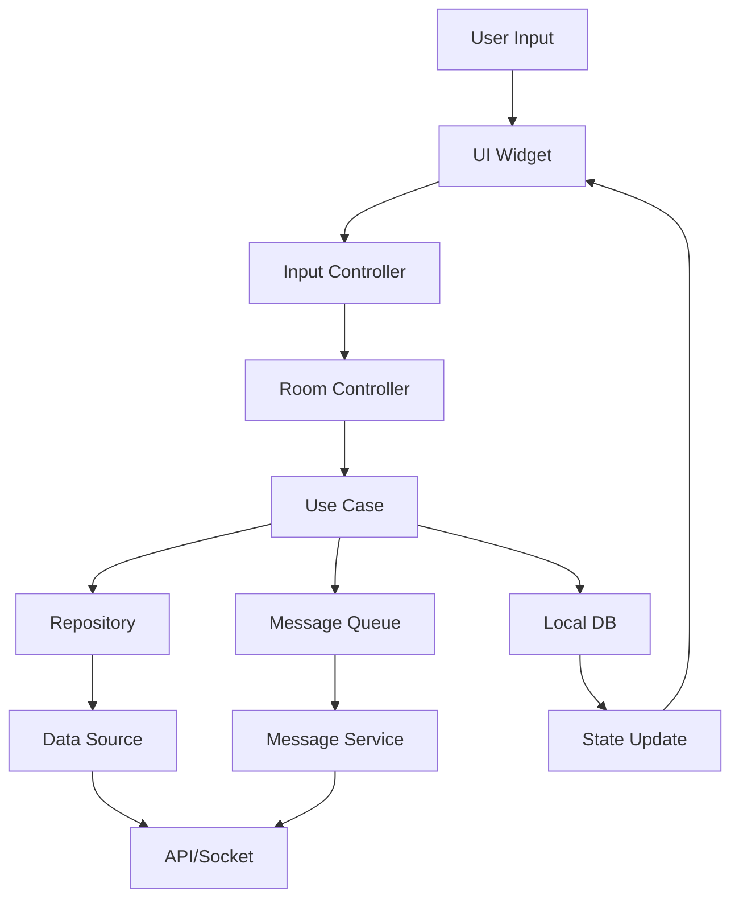

# Send Message System Overview

## System Overview

The UChat Messenger send message system uses Clean Architecture divided into 3 main layers:

1. **Presentation Layer** - UI and Controllers
2. **Domain Layer** - Business Logic and Use Cases  
3. **Data Layer** - Repositories and Data Sources

## Architecture Diagram



## All Features

### 1. Message Types
- **Text Message** - Plain text message with link preview and emoji detection
- **File Message** - Send document files
- **Image/Video Message** - Send images and videos
- **Sticker Message** - Send stickers
- **GIF Message** - Send GIFs from Giphy
- **Location Message** - Share location
- **Contact Message** - Share contacts (UChat and phone contacts)
- **Audio Message** - Send voice messages

### 2. Message Features
- **Reply Message** - Reply to messages
- **Edit Message** - Edit messages
- **Delete/Unsend Message** - Delete messages
- **Lock Message** - Lock messages with password
- **Encrypted Message** - E2E encryption for secret rooms

### 3. System Components

#### Message Queue System
- Manages message sending queue in sequence
- Retry mechanism for failed messages
- Track sending status (sending, sent, failed)

#### Encryption System
- Room-level encryption (E2E)
- Message-level lock (password protection)
- PBKDF2 key derivation for lock messages

## File Structure

```
lib/features/chat_room/
├── presentation/
│   ├── controllers/
│   │   ├── chat_room_controller.dart
│   │   └── input/
│   │       └── chat_room_input_controller.dart
│   └── widgets/
│       └── input/
│           ├── chat_room_text_input.dart
│           ├── chat_room_sticker_input.dart
│           └── ...
├── domain/
│   ├── use_cases/
│   │   ├── send_message_to_server_use_case.dart
│   │   ├── send_file_message_to_server_use_case.dart
│   │   └── ...
│   ├── entities/
│   └── params/
└── data/
    ├── repositories/
    ├── data_sources/
    └── models/
        └── send_message_payload/
```

## Main Flow Steps

1. **User Input** - User types message or selects file
2. **Validation** - Validate data integrity
3. **Prepare Message** - Create MessageCollection object
4. **Save to Local** - Save message to local DB first
5. **Encryption** (if any) - Encrypt message
6. **Queue Message** - Add message to queue
7. **Send to Server** - Send message to server via API/Socket
8. **Handle Response** - Handle response and update state
9. **Update UI** - Display message on UI

## Key Classes

| Class | Responsibility | Location |
|-------|---------------|----------|
| `ChatRoomController` | Manages chat room state | `presentation/controllers/chat_room_controller.dart:118` |
| `ChatRoomInputController` | Manages input and keyboard | `presentation/controllers/input/chat_room_input_controller.dart:63` |
| `SendMessageToServerUseCase` | Business logic for sending messages | `domain/use_cases/send_message_to_server_use_case.dart:33` |
| `MessageQueueService` | Manages message sending queue | `core/services/messaging/message_queue_service.dart:27` |
| `MessageCollection` | Main message model | `data/models/collections/message_collection.dart` |

## Related Documents

- [Text Message Flow](./text_message_flow.md) - Detailed text message sending flow
- [File Message Flow](./file_message_flow.md) - File and image sending flow
- [Special Messages](./special_messages.md) - Special message types
- [Encryption Flow](./encryption_flow.md) - Encryption system
- [Queue System](./queue_system.md) - Message queue system
- [Data Models](./data_models.md) - Models and collections structure