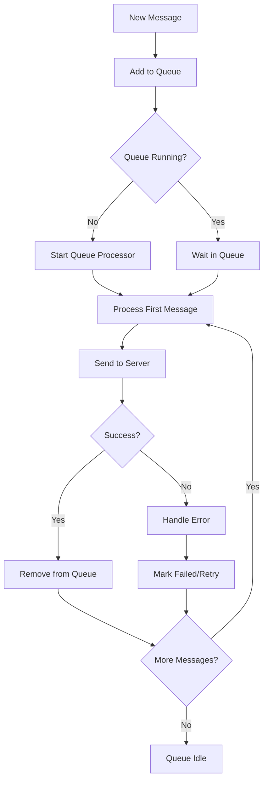
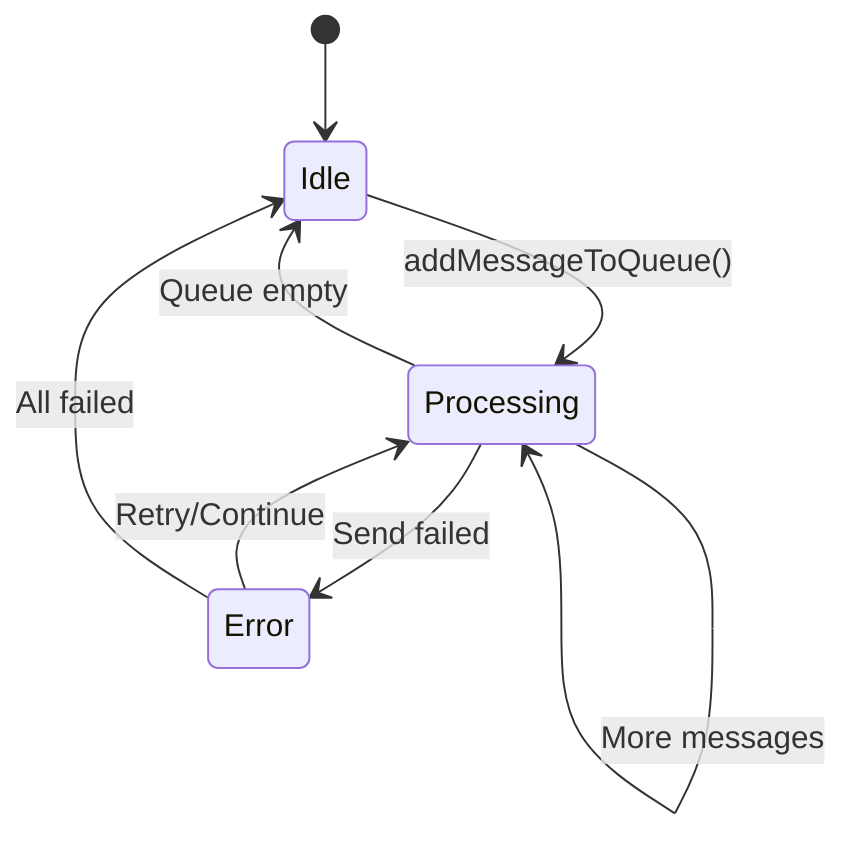

# Message Queue System

## Overview

MessageQueueService manages the message sending queue system to ensure messages are sent in order and handles error cases

**File:** `lib/core/services/messaging/message_queue_service.dart:27`

## Architecture



## Core Components

### 1. MessageQueueService Class Structure

```dart
class MessageQueueService {
  static final MessageQueueService instance = MessageQueueService._internal();
  
  // Queue state tracking
  final _sendMessageQueueRunning = HashMap<String, bool>();
  final _sendMessageQueueProcess = HashMap<String, Future<void>?>();
  final _sendMessageQueue = HashMap<String, List<MessageQueueItem>>();
  
  // File upload tracking
  final SendingFileRequestMap sendingFileRequests = {};
}
```

### 2. MessageQueueItem Structure

```dart
class MessageQueueItem {
  final String roomId;
  final SendMessageRequestInterface messageRequest;
  final MessageQueueProcessingCallback? onProcessing;
  
  MessageQueueItem({
    required this.roomId,
    required this.messageRequest,
    this.onProcessing,
  });
}
```

### 3. Type Definitions

```dart
typedef MessageQueueProcessingCallback = Future<void> Function({
  required SendMessageRequestInterface requestData
});

typedef SendingFileRequestMap = Map<String?, SendFileMessageRequest>;
```

## Queue Management

### 1. Add Message to Queue

**Method:** `addMessageToQueue()` - line 71

```dart
Future<void> addMessageToQueue({
  required SendMessageRequestInterface messageRequest,
  MessageQueueProcessingCallback? onProcessing,
}) async {
  final roomId = messageRequest.roomId;
  
  // Initialize queue structures
  _sendMessageQueueProcess.putIfAbsent(roomId, () => null);
  _sendMessageQueue.putIfAbsent(roomId, () => []);
  
  // Add message to queue
  _sendMessageQueue[roomId]?.add(MessageQueueItem(
    roomId: roomId,
    messageRequest: messageRequest,
    onProcessing: onProcessing,
  ));
  
  // Mark message as running
  _sendMessageQueueRunning.assign(messageRequest.ref, true);
  
  // Start processing if not already running
  if (_sendMessageQueueProcess[roomId] == null) {
    _sendMessageQueueProcess[roomId] = _processSendMessageQueue(roomId: roomId);
    await _sendMessageQueueProcess[roomId];
  }
}
```

### 2. Queue Processing Logic

**Method:** `_processSendMessageQueue()` - line 119

```dart
Future<void> _processSendMessageQueue({required String roomId}) async {
  if (_sendMessageQueueProcess[roomId] != null) return;
  _sendMessageQueue.putIfAbsent(roomId, () => []);
  
  // Process queue until empty
  while (_sendMessageQueue[roomId]?.isNotEmpty == true) {
    // Get first message and remove from queue
    final messageQueueItem = _sendMessageQueue[roomId]?.removeAt(0);
    final metricDuration = Metric.startDuration('MessageRef:${messageQueueItem?.messageRequest.ref ?? 'NULL'}');
    
    final requestData = messageQueueItem?.messageRequest;
    final onProcessing = messageQueueItem?.onProcessing;
    
    // Validate request data
    if (requestData == null || onProcessing == null) {
      _log.e('Process message queue error: Request data is null');
      continue;
    }
    
    try {
      // Handle file messages special tracking
      if (requestData is SendMultiFileMessageRequest) {
        for (final request in requestData.requestList) {
          sendingFileRequests[request.refFile] = request;
        }
      } else if (requestData is SendFileMessageRequest) {
        sendingFileRequests[requestData.refFile] = requestData;
      }
      
      // Process the message
      await onProcessing(requestData: requestData);
      
      // Clean up file tracking
      if (requestData is SendFileMessageRequest) {
        sendingFileRequests.remove(requestData.refFile);
      }
      
    } catch (e, stackTrace) {
      _log.e('Process message in queue error', e, stackTrace);
    } finally {
      // Mark message as no longer running
      _sendMessageQueueRunning.remove(requestData.ref);
      metricDuration.end();
    }
  }
}
```

## Queue State Management

### 1. Queue Status Checking

```dart
// Check if message is in queue
bool inMessageQueue(String roomId, String messageRef) {
  _sendMessageQueue.putIfAbsent(roomId, () => []);
  try {
    return _sendMessageQueueRunning[messageRef] ?? false;
  } catch (e) {
    return false;
  }
}

// Check if file is being uploaded
bool inSendingFileQueue(String refFile) {
  return sendingFileRequests.containsKey(refFile);
}
```

### 2. Queue Lifecycle



## Message Processing Flow

### 1. Standard Message Processing

```dart
// Called from SendMessageToServerUseCase
await MessageQueueService.instance.addMessageToQueue(
  messageRequest: sendMessageRequestPayload,
  onProcessing: onSendMessageProcessing,
);

// Processing callback
Future<void> onSendMessageProcessing({
  required SendMessageRequestInterface requestData,
}) async {
  try {
    // Send message to server
    final msgResp = await MessageService.instance.sendMessageRequest2(requestData);
    
    if (msgResp == null) {
      requestData.onSendFail?.call();
      return;
    }
    
    // Handle successful response
    await handleSuccessfulResponse(msgResp);
    
  } catch (e) {
    // Handle errors
    requestData.onSendFail?.call();
    rethrow;
  }
}
```

### 2. File Message Processing

```dart
// File messages have additional upload tracking
SendFileMessageRequest fileRequest = ...;

// Add to file tracking map
sendingFileRequests[fileRequest.refFile] = fileRequest;

// Process file upload + send
await onProcessing(requestData: fileRequest);

// Clean up tracking
sendingFileRequests.remove(fileRequest.refFile);
```

## Error Handling

### 1. Network Errors

```dart
on DioException catch (e, stackTrace) {
  _log.d('Cannot send message.', e, stackTrace);
  
  if (e.type != DioExceptionType.cancel) {
    // Call failure callback
    requestData.onSendFail?.call();
    
    // Send analytics
    GetIt.I<TaxonomyService>().sendEvent(
      EventName.chatErrorOccurred,
      eventProperties: EventProperty.appErrorOccurred(
        errorType: e.type.toString(),
        errorMessage: e.message
      )
    );
  }
}
```

### 2. API Errors

```dart
on ApiException catch (e, stackTrace) {
  _log.d('Cannot send message.', e, stackTrace);
  
  final errorType = ApiExceptionType.from(e.type);
  
  if (errorType == ApiExceptionType.messageRefDuplicateError) {
    // Handle duplicate message (already sent)
    final sentMessage = requestData.initMessage.copy();
    sentMessage.isSendFailed = false;
    sentMessage.isSending = false;
    
    await messageDb.putMessage(sentMessage);
    eventBus.fire(MessageUpdateEvent(message: sentMessage));
  } else {
    // Other errors - mark as failed
    requestData.onSendFail?.call();
  }
}
```

### 3. Queue Processing Errors

```dart
try {
  await onProcessing(requestData: requestData);
} catch (e, stackTrace) {
  _log.e(UChatLogMessage(
    message: 'Process message in queue error.',
    error: e,
    stackTrace: stackTrace,
    additionalData: {
      'messageRef': requestData.ref,
      'roomId': requestData.roomId,
    },
  ));
} finally {
  // Always clean up tracking
  _sendMessageQueueRunning.remove(requestData.ref);
}
```

## Performance Optimizations

### 1. Per-Room Queues

```dart
// Separate queues per room for parallel processing
final _sendMessageQueue = HashMap<String, List<MessageQueueItem>>();
final _sendMessageQueueProcess = HashMap<String, Future<void>?>();

// Room A and Room B can process messages simultaneously
// But messages within each room are processed sequentially
```

### 2. Memory Management

```dart
// Clean up completed processes
try {
  _sendMessageQueueProcess[roomId] = _processSendMessageQueue(roomId: roomId);
  await _sendMessageQueueProcess[roomId];
} finally {
  _sendMessageQueueProcess[roomId] = null; // Free memory
}
```

### 3. Metrics Tracking

```dart
final metricDuration = Metric.startDuration('MessageRef:${messageRef}');
try {
  // Process message
} finally {
  metricDuration.end(); // Track processing time
}
```

## Queue Debugging

### 1. Queue State Inspection

```dart
// Get current queue state
HashMap<String, List<MessageQueueItem>> get sendMessageQueue => _sendMessageQueue;

// Check running processes
final isProcessing = _sendMessageQueueProcess[roomId] != null;

// Get queue length
final queueLength = _sendMessageQueue[roomId]?.length ?? 0;
```

### 2. Logging

```dart
_log.e(UChatLogMessage(
  message: 'Process message queue error.',
  error: e,
  stackTrace: stackTrace,
  additionalData: {
    'remainQueue': _sendMessageQueue[roomId]?.length,
    'roomId': roomId,
    'messageRef': requestData?.ref,
  },
));
```

## File Upload Queue

### 1. File Request Tracking

```dart
final SendingFileRequestMap sendingFileRequests = {};

// Track file upload progress
sendingFileRequests[fileId] = SendFileMessageRequest(...);

// Check if file is uploading
bool inSendingFileQueue(String refFile) {
  return sendingFileRequests.containsKey(refFile);
}
```

### 2. Multi-File Upload

```dart
if (requestData is SendMultiFileMessageRequest) {
  // Track all files in the batch
  for (final request in requestData.requestList) {
    sendingFileRequests[request.refFile] = request;
  }
}

// Clean up after processing
for (final request in requestData.requestList) {
  sendingFileRequests.remove(request.refFile);
}
```

## Queue Integration Points

### 1. Use Case Integration

```dart
// SendMessageToServerUseCase
await MessageQueueService.instance.addMessageToQueue(
  messageRequest: sendMessageRequestPayload,
  onProcessing: onSendMessageProcessing,
);
```

### 2. UI Integration

```dart
// Check sending status in UI
final isSending = MessageQueueService.instance.inMessageQueue(roomId, messageRef);

// Show progress indicator
if (isSending) {
  return CircularProgressIndicator();
}
```

### 3. State Management

```dart
// Queue fires these events:
eventBus.fire(AddMessageToStateEvent(message: localMessage));        // When queued
eventBus.fire(MessageUpdateEvent(message: responseMessage));         // When sent
eventBus.fire(AddFailedMessageToStateEvent(message: failedMessage)); // When failed
```

## Best Practices

### 1. Queue Usage
- ✅ Always use queue for message sending
- ✅ Handle onSendFail callbacks properly
- ✅ Clean up resources in finally blocks
- ❌ Don't bypass the queue system
- ❌ Don't block the queue with long operations

### 2. Error Handling
- ✅ Distinguish between retryable and non-retryable errors
- ✅ Provide user feedback for failed messages
- ✅ Log errors with sufficient context
- ❌ Don't silently swallow errors
- ❌ Don't retry indefinitely

### 3. Performance
- ✅ Use per-room queues for parallelism
- ✅ Clean up completed processes
- ✅ Track metrics for monitoring
- ❌ Don't create unnecessary queue items
- ❌ Don't hold references to large objects