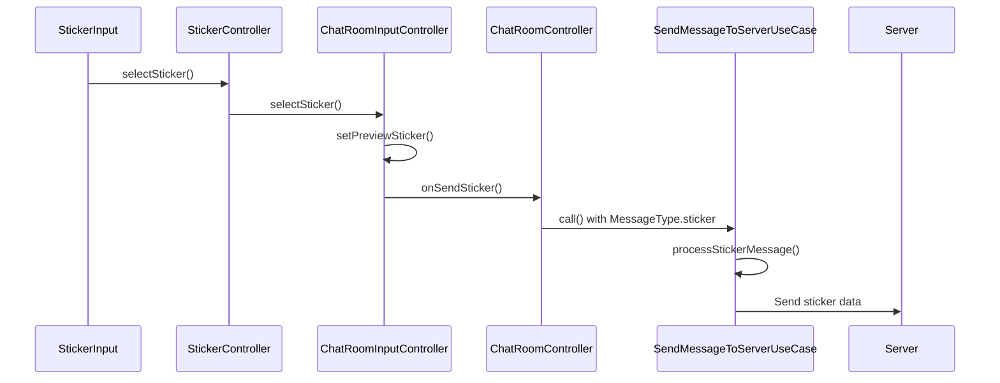
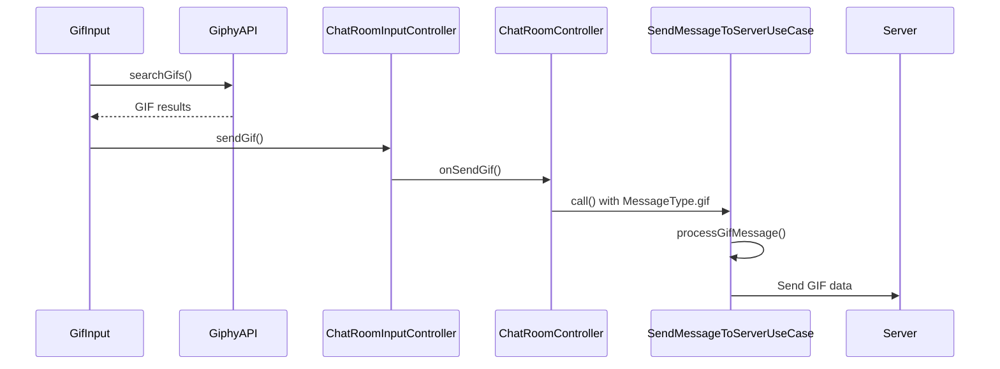
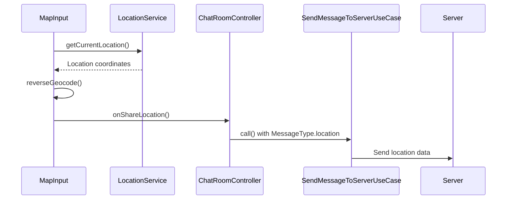
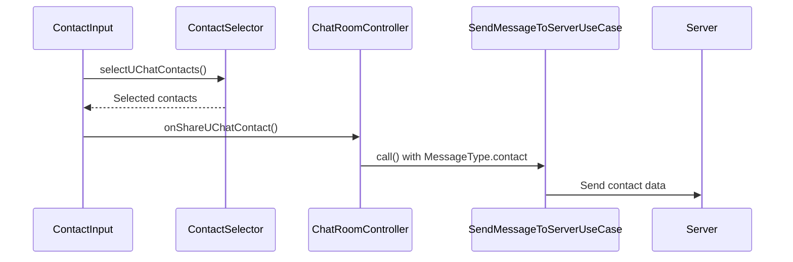
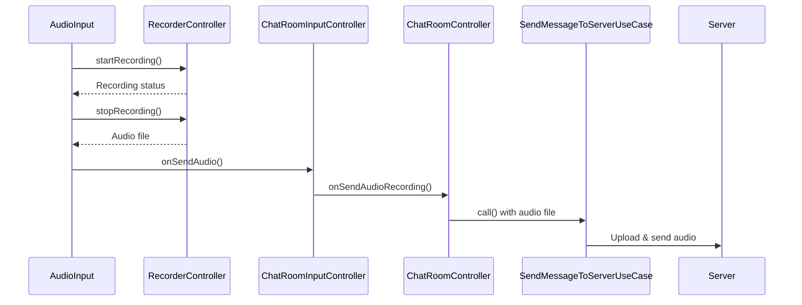
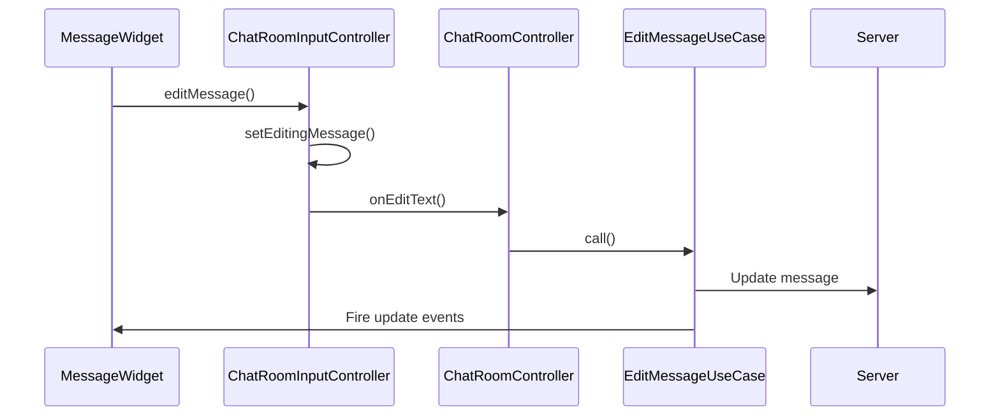

# Special Messages Flow

## Overview

Special message types that have specific handling but use the same basic flow as regular messages

## Supported Special Message Types

### 1. Sticker Messages
### 2. GIF Messages  
### 3. Location Messages
### 4. Contact Messages (UChat + Phone)
### 5. Audio Messages
### 6. Reply Messages
### 7. Edit Messages

---

## 1. Sticker Message Flow



### Sticker Input Flow

**File:** `lib/features/chat_room/presentation/widgets/input/chat_room_sticker_input.dart`

```dart
StickerGrid.onStickerTap()
├── Create StickerSendingEntity
├── Call ChatRoomInputController.selectSticker()
└── Show sticker preview OR send immediately
```

**File:** `lib/features/chat_room/presentation/controllers/input/chat_room_input_controller.dart`

```dart
selectSticker(StickerSendingEntity sticker, Function onSendSticker) // line 1082
├── Check if same sticker as preview
├── If same → Send immediately via onSendSticker()
├── If different → Set as preview sticker
└── Update UI to show preview
```

### Sticker Send Processing  

**File:** `lib/features/chat_room/presentation/controllers/chat_room_controller.dart`

```dart
onSendSticker(StickerSendingEntity sticker) // line 766
├── Analytics tracking (sticker name, publisher)
├── Handle reply message
├── Create MessageCollection:
│   ├── type: MessageType.sticker
│   └── meta: MessageMetaModel(
│       ├── stickerPack: sticker.stickerPackId
│       └── stickerValue: sticker.stickerId
│   )
└── Call SendMessageToServerUseCase
```

### Sticker Metadata Structure
```dart
MessageMetaModel(
  stickerPack: "pack-id-123",      // Sticker pack identifier
  stickerValue: "sticker-001",     // Individual sticker ID
)
```

---

## 2. GIF Message Flow



### GIF Input Flow

**File:** `lib/features/chat_room/presentation/widgets/input/chat_room_gif_input.dart`

```dart
GifGrid.onGifTap()
├── Create GifSendingEntity from Giphy data
├── Call ChatRoomInputController.sendGif()
└── Send immediately (no preview)
```

**File:** `lib/features/chat_room/presentation/controllers/input/chat_room_input_controller.dart`

```dart
sendGif(GifSendingEntity entity, Function onSendGif) // line 1103
└── Call onSendGif() callback immediately
```

### GIF Send Processing

**File:** `lib/features/chat_room/presentation/controllers/chat_room_controller.dart`

```dart
onSendGif(GifSendingEntity gif) // line ~850
├── Handle reply message
├── Create MessageCollection:
│   ├── type: MessageType.gif
│   └── meta: MessageMetaModel(
│       ├── gifUrl: gif.gifUrl
│       ├── gifMp4Url: gif.mp4Url  
│       ├── gifWebpUrl: gif.webpUrl
│       ├── giphyId: gif.giphyId
│       ├── gifWidth: gif.width
│       └── gifHeight: gif.height
│   )
└── Call SendMessageToServerUseCase
```

### GIF Metadata Structure
```dart
MessageMetaModel(
  gifUrl: "https://media.giphy.com/media/ID/giphy.gif",
  gifMp4Url: "https://media.giphy.com/media/ID/giphy.mp4",
  gifWebpUrl: "https://media.giphy.com/media/ID/giphy.webp",
  giphyId: "giphy-id-123",
  gifWidth: 480,
  gifHeight: 360,
)
```

---

## 3. Location Message Flow



### Location Input Flow

**File:** `lib/features/chat_room/presentation/controllers/input/chat_room_input_controller.dart`

```dart
shareLocation(Function onShareLocation)
├── Request location permissions
├── Get current GPS coordinates
├── Reverse geocoding for address
├── Create MapInfoResponse object
└── Call onShareLocation() callback
```

### Location Send Processing

**File:** `lib/features/chat_room/presentation/controllers/chat_room_controller.dart`

```dart
onShareLocation(MapInfoResponse location)
├── Handle reply message
├── Create MessageCollection:
│   ├── type: MessageType.location
│   └── meta: MessageMetaModel(
│       ├── locationLat: location.latitude
│       ├── locationLng: location.longitude
│       ├── locationName: location.name
│       ├── locationFormattedAddress: location.address
│       ├── locationPlacesId: location.placeId
│       └── locationVicinity: location.vicinity
│   )
└── Call SendMessageToServerUseCase
```

### Location Metadata Structure
```dart
MessageMetaModel(
  locationLat: 13.7563309,
  locationLng: 100.5017651,
  locationName: "Siam Paragon",
  locationFormattedAddress: "991 Rama I Rd, Pathum Wan, Bangkok 10330",
  locationPlacesId: "ChIJ...",
  locationVicinity: "Pathum Wan",
)
```

---

## 4. Contact Message Flow

### 4.1 UChat Contact Sharing



**File:** `lib/features/chat_room/presentation/controllers/input/chat_room_input_controller.dart`

```dart
selectUChatFriends(Function onShareUChatContact)
├── Open contact selection modal
├── Filter available UChat contacts
├── Allow multiple selection
├── Return List<ContactCollection>
└── Call onShareUChatContact() callback
```

### UChat Contact Send Processing

**File:** `lib/features/chat_room/presentation/controllers/chat_room_controller.dart`

```dart
onShareUChatContact(List<ContactCollection> contacts)
├── Create separate message for each contact
├── For each contact:
│   ├── type: MessageType.contact  
│   ├── contact: ContactModel
│   └── message: "@${contact.displayName}"
└── Send all messages via SendMessageToServerUseCase
```

### 4.2 Phone Contact Sharing

```dart
onSharePhoneContact(List<Contact> phoneContacts)
├── Create separate message for each contact
├── For each contact:
│   ├── type: MessageType.mobileContact
│   ├── mobileContact: MobileContactModel
│   └── message: "${contact.displayName}"
└── Send all messages via SendMessageToServerUseCase
```

---

## 5. Audio Message Flow



### Audio Recording Flow

**File:** `lib/features/chat_room/presentation/widgets/input/chat_room_audio_input.dart`

```dart
AudioRecordingFlow:
├── Request microphone permission
├── Start recording with RecorderController
├── Show waveform visualization
├── Handle recording pause/resume
├── Stop recording on button release
├── Generate audio file
└── Call onSendAudio() callback
```

### Audio Send Processing

**File:** `lib/features/chat_room/presentation/controllers/input/chat_room_input_controller.dart`

```dart
onSendAudio(Function onSendAudioRecording) // line 801
├── Stop audio player if playing
├── Create FileInfoModel from audio file
├── Call onSendAudioRecording() callback
└── Reset audio recording state
```

---

## 6. Reply Message Flow

### Reply Setup

**File:** `lib/features/chat_room/presentation/controllers/chat_room_controller.dart`

```dart
setRepliedMessage(MessageCollection? replyMsg)
├── Set repliedMessage.value = replyMsg
├── Update input UI to show reply preview
├── Focus text field for user input
└── Reply data passed to SendMessageToServerUseCase
```

### Reply Processing in Use Case

**File:** `lib/features/chat_room/domain/use_cases/send_message_to_server_use_case.dart`

```dart
putMessageToLocal() // line 121
├── Set initialMessage.replyMessage = params.replyMessage
├── Save message with reply reference
└── UI shows reply thread connection
```

### Reply Message Structure
```dart
MessageCollection(
  message: "Reply text content",
  type: MessageType.text,
  replyMessage: MessageModel(
    id: "original-msg-id",
    message: "Original message content",
    accountId: "original-sender-id",
    accountName: "Original Sender Name",
  ),
)
```

---

## 7. Edit Message Flow



### Edit Message Setup

**File:** `lib/features/chat_room/presentation/controllers/input/chat_room_input_controller.dart`

```dart
setEditingMessage(MessageEntity message)
├── Set editingMessage.value = message
├── Pre-fill text field with existing content
├── Change send button to "edit" mode
└── Show edit mode UI indicators
```

### Edit Message Processing

**File:** `lib/features/chat_room/presentation/controllers/chat_room_controller.dart`

```dart
onEditText(EditMessageRequest request) // line 755
├── Create EditMessageParams
├── Call EditMessageUseCase (not SendMessageToServerUseCase)
├── Send analytics event
└── Update message via different flow
```

## Common Patterns

### 1. Message Metadata Pattern
```dart
// All special messages follow this pattern:
MessageCollection(
  message: "Display text or null",
  type: MessageType.[specific_type],
  meta: MessageMetaModel(
    // Type-specific metadata fields
  ),
  // Common fields: replyMessage, files, links, etc.
)
```

### 2. Analytics Tracking Pattern
```dart
// All message types track analytics:
GetIt.I<TaxonomyService>().sendEvent(
  EventName.messageSent,
  eventProperties: EventProperty.messageSent(
    chatType, // group/direct/secret
    mediaType // text/sticker/gif/location/etc
  )
);
```

### 3. Reply Message Pattern
```dart
// All message types support replies:
MessageModel? replyMessage;
if (repliedMessage.value != null) {
  replyMessage = repliedMessage.value?.toModel();
  setRepliedMessage(null); // Clear after use
}
```

### 4. Error Handling Pattern
```dart
// All special messages use same error handling:
try {
  await SendMessageToServerUseCase.call(params);
} catch (e) {
  // Mark message as failed
  // Show retry option
  // Fire error events
}
```

## Special Message Encryption

### Lock Message Support
```dart
// Special messages that support lock:
├── MessageType.text ✓
├── MessageType.gif ✓ (encrypt URLs)
├── MessageType.location ✓ (encrypt name/vicinity)  
├── MessageType.mobileContact ✓ (encrypt name/phone)
├── MessageType.sticker ✓ (encrypt validation data)
└── MessageType.contact ✓ (encrypt validation data)
```

### Room Encryption Support
```dart
// All message types support room-level encryption
if (params.roomCryptoKey != null) {
  // Encrypt message content before sending
  // Decrypt on receive
}
```