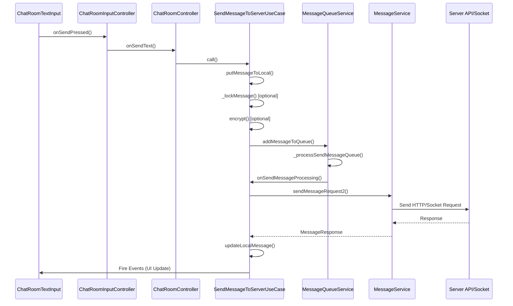

# Text Message Flow

## Call Stack Overview



## Detailed Flow Steps

### 1. UI Layer - User Input

**File:** `lib/features/chat_room/presentation/widgets/input/chat_room_text_input.dart`

```dart
// User presses send button
ChatRoomTextInput.build() // line 68
└── MentionTextField.onFieldSubmitted
    └── SendIcon.onPressed
        └── onSendText() callback
```

**Key Properties:**
- `onSendText: Function({List<MessageLinkModel> links, required String message})`
- Input validation and mention detection

### 2. Input Controller - Text Processing

**File:** `lib/features/chat_room/presentation/controllers/input/chat_room_input_controller.dart`

```dart
onSendPressed() // line 980
├── textFieldController.text validation
├── Link detection and metadata extraction
├── Edit message handling
└── onSendText() callback to ChatRoomController
```

**Input Processing:**
- Text validation (empty check)
- Link preview extraction
- Reply/Edit message handling
- Text field cleanup

### 3. Room Controller - Message Preparation

**File:** `lib/features/chat_room/presentation/controllers/chat_room_controller.dart`

```dart
onSendText(String message, List<MessageLinkModel> links) // line 690
├── Reply message preparation
├── Emoji detection (isOnlyEmojis)
├── Link type classification
├── Analytics event tracking
└── SendMessageToServerUseCase.call()
```

**Parameters Created:**
```dart
SendMessageToServerParams(
  chatRoomId: roomId,
  isSecretRoom: roomType == RoomType.directSecret,
  isShare: false,
  message: MessageCollection(
    message: message,
    type: MessageType.text,
    meta: MessageMetaModel(
      isEmoji: isOnlyEmojis,
      isRegEx: containsMentionOrContact,
    ),
    links: links,
  ),
  roomCryptoKey: roomCryptoKey.value,
  accountId: currentUser!.id!,
  isSending: true,
  replyMessage: replyMessage,
)
```

### 4. Domain Layer - Business Logic

**File:** `lib/features/chat_room/domain/use_cases/send_message_to_server_use_case.dart`

```dart
SendMessageToServerUseCase.call(SendMessageToServerParams params) // line 50
├── Step 1: putMessageToLocal() // line 55
├── Step 2: _lockMessage() [if isLocked] // line 62
├── Step 3: encrypt() [if roomCryptoKey] // line 75
├── Step 4: Create SendMessageRequest // line 91
└── Step 5: MessageQueueService.addMessageToQueue() // line 110
```

#### Step 1: Save to Local Database
```dart
putMessageToLocal(SendMessageToServerParams params) // line 121
├── Generate messageRef = MessageService.generateMsgUid()
├── Set message properties (id, ref, roomId, accountId, createdAt)
├── Handle reply message assignment
└── messageDb.putMessage() // Save to local DB
```

#### Step 2: Lock Message (Optional)
```dart
_lockMessage(MessageCollection message, String roomId) // line 306
├── Get room password from roomSubscriptionDb
├── Generate salt and iv (UUID v4)
├── Create PBKDF2 crypto key
├── Encrypt message content based on type:
│   ├── MessageType.text → encrypt message text
│   ├── MessageType.mobileContact → encrypt name/phone
│   ├── MessageType.gif → encrypt gif URLs
│   ├── MessageType.location → encrypt location data
│   └── Other types → save lockMessageData for validation
└── Update message.meta with encryption data
```

#### Step 3: Room Encryption (Optional)
```dart
if (params.roomCryptoKey != null) // line 75
├── EncryptHelper.encrypt()
├── Set updatedMessage.isEncrypted = true
└── Handle encryption errors
```

#### Step 4: Create Send Request
```dart
SendMessageRequest() // line 91
├── roomId, message, ref, replyId
├── contactId, mobileContact
├── isEncrypted, isLocked, bookmarkTagId
└── onSendFail callback
```

### 5. Message Queue System

**File:** `lib/core/services/messaging/message_queue_service.dart`

```dart
MessageQueueService.addMessageToQueue() // line 71
├── Add message to room queue
├── Set message as running
├── _processSendMessageQueue() // line 119
└── Process queue sequentially
```

#### Queue Processing:
```dart
_processSendMessageQueue(String roomId) // line 119
├── Loop until queue is empty
├── Remove first message from queue
├── Call onProcessing callback
├── Handle success/failure
└── Update message status
```

### 6. Send to Server

**File:** `lib/features/chat_room/domain/use_cases/send_message_to_server_use_case.dart`

```dart
onSendMessageProcessing(SendMessageRequestInterface requestData) // line 164
├── MessageService.sendMessageRequest2() // line 174
├── Handle server response
├── Decrypt response message [if encrypted]
├── Update local database
├── Update room subscription
├── Fire UI update events
└── Handle errors (DioException, ApiException)
```

#### Success Flow:
```dart
if (msgResp != null) // line 176
├── Update sticker history [if sticker]
├── Decrypt message [if encrypted] // line 207
├── messageDb.putMessage() // line 221
├── Update room subscription last message
└── Fire MessageUpdateEvent
```

#### Error Handling:
```dart
catch (DioException e) // line 265
├── Call requestData.onSendFail()
├── Send error analytics
└── Cancel vs other error handling

catch (ApiException e) // line 276  
├── Handle duplicate message ref
├── Set message as sent [if duplicate]
└── Call onSendFail for other errors
```

### 7. Local State Update

**Events Fired:**
- `AddMessageToStateEvent` - When starting to send message (line 57)
- `MessageUpdateEvent` - When message sent successfully (line 260)
- `AddFailedMessageToStateEvent` - When message sending failed (line 454)
- `RoomUpdateSubscriptionEvent` - Update last message (line 236)

## Method Call Summary

| Layer | File | Method | Line | Description |
|-------|------|---------|------|-------------|
| UI | `chat_room_text_input.dart` | `build()` | 68 | Render text input widget |
| Input Controller | `chat_room_input_controller.dart` | `onSendPressed()` | 980 | Handle send button press |
| Room Controller | `chat_room_controller.dart` | `onSendText()` | 690 | Prepare message data |
| Use Case | `send_message_to_server_use_case.dart` | `call()` | 50 | Main business logic |
| Use Case | `send_message_to_server_use_case.dart` | `putMessageToLocal()` | 121 | Save to local DB |
| Use Case | `send_message_to_server_use_case.dart` | `_lockMessage()` | 306 | Lock message encryption |
| Queue Service | `message_queue_service.dart` | `addMessageToQueue()` | 71 | Add to send queue |
| Queue Service | `message_queue_service.dart` | `_processSendMessageQueue()` | 119 | Process queue |
| Use Case | `send_message_to_server_use_case.dart` | `onSendMessageProcessing()` | 164 | Send to server |

## Key Data Transformations

### 1. User Input → MessageCollection
```dart
String message + List<MessageLinkModel> links
↓
MessageCollection(
  message: message,
  type: MessageType.text,
  meta: MessageMetaModel(isEmoji, isRegEx),
  links: links,
)
```

### 2. MessageCollection → SendMessageRequest  
```dart
MessageCollection + params
↓
SendMessageRequest(
  roomId, message, ref, replyId,
  contactId, mobileContact,
  isEncrypted, isLocked, bookmarkTagId
)
```

### 3. SendMessageRequest → Server API Payload
```dart
SendMessageRequest.toMap() // line 40
↓
{
  'roomId': roomId,
  'message': message.message,
  'type': message.type?.value,
  'ref': ref,
  'meta': {...},
  'replyId': replyId,
  ...
}
```

## Error Handling

### Types of Failures:
1. **Network Errors** - DioException, timeout, no connection
2. **Server Errors** - API errors, validation failures  
3. **Duplicate Message** - Message ref already exists
4. **Encryption Errors** - Failed to encrypt/decrypt

### Recovery Mechanisms:
1. **Retry Queue** - Failed messages stay in queue for retry
2. **Local State** - Message marked as failed with retry option
3. **User Feedback** - Show failed state in UI
4. **Analytics** - Track error types for monitoring

### Failed Message Callback:
```dart
onSendFileCallback() // line 437
├── Update message.isSendFailed = true
├── Fire ToggleFailedMessageEvent
├── Fire AddFailedMessageToStateEvent  
└── Update UI to show retry option
```